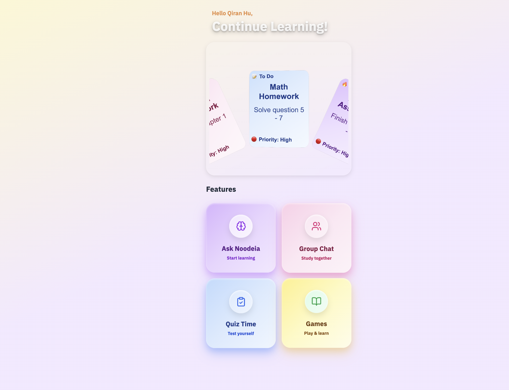
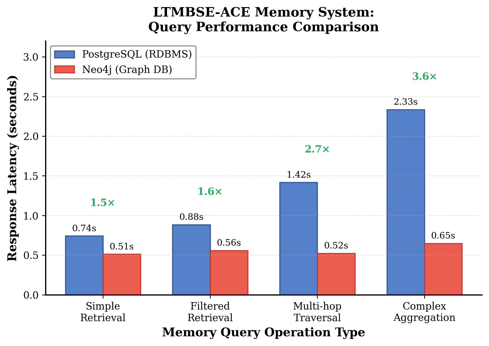
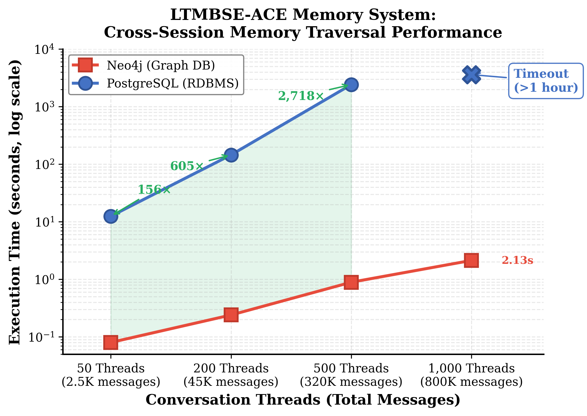
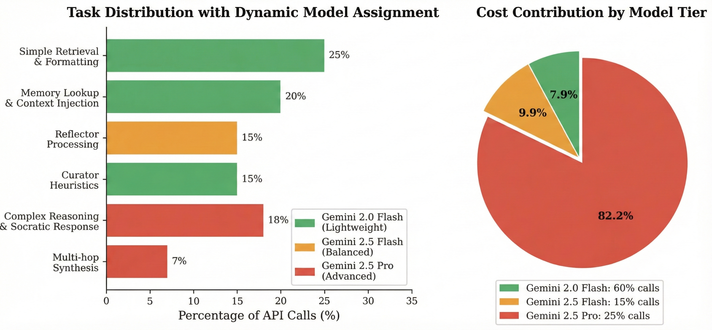
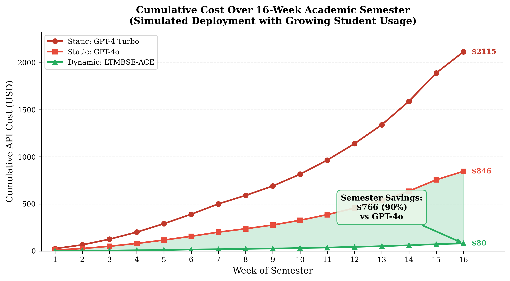
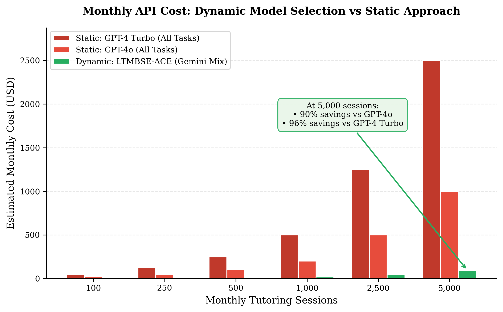
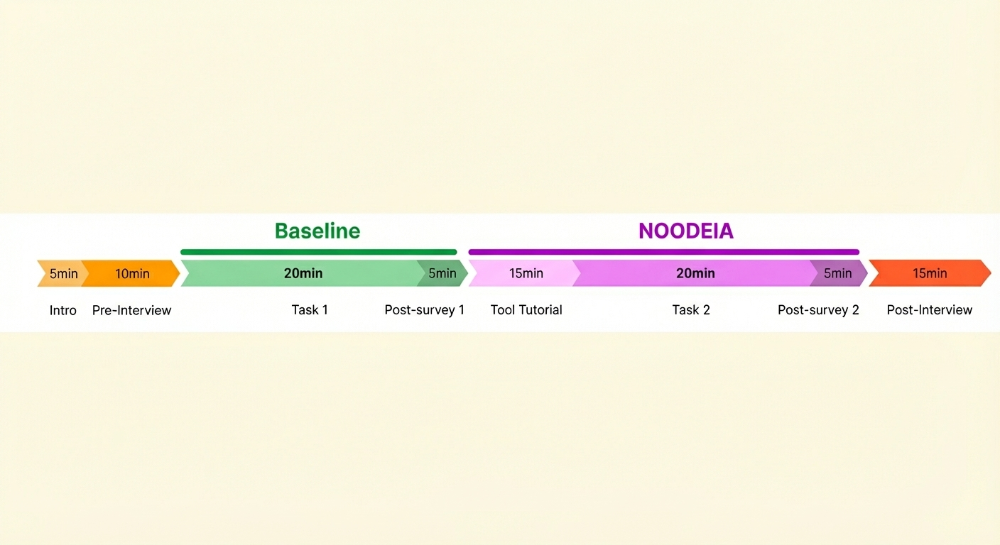
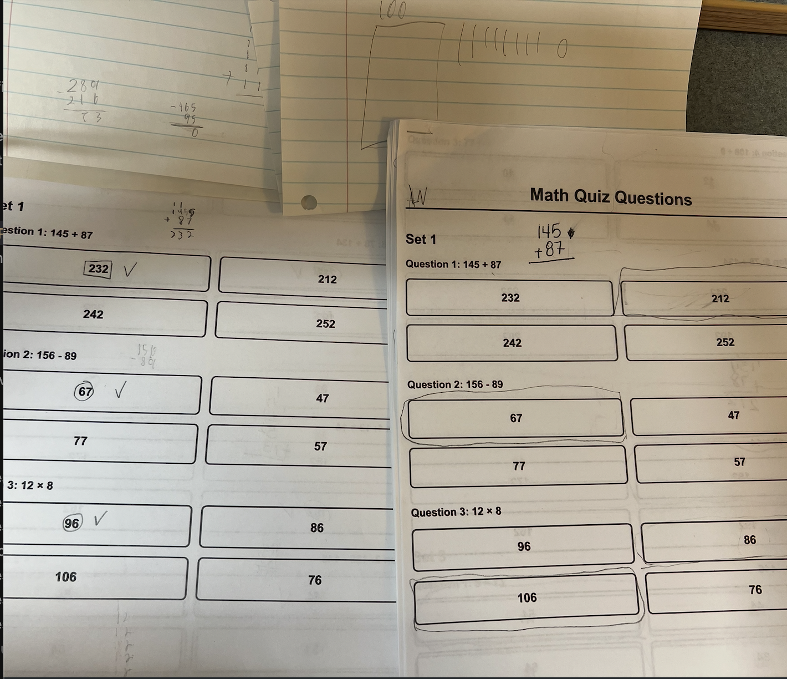
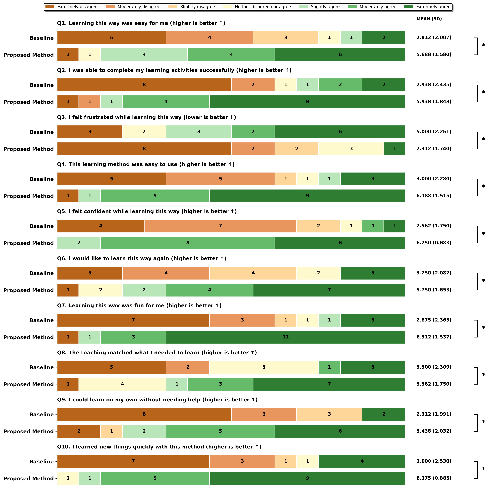

# NOODEIA: Long-Term Memory-Based Self-Evolving Agentic Context Engineering for Personalized AI Tutoring

Authors: Qiran Hu, Ryan Pearlman, Rosie Xu, Tony Yu

* * *

## Abstract

American education faces a critical challenge: fewer than half of students read at grade level, and over 400,000 teaching positions remain unfilled or understaffed. While after-school programs work to address these gaps, traditional one-to-many instruction cannot provide the personalized attention that struggling learners need. We present NOODEIA, an AI-powered tutoring platform that implements a series of learning games and an AI with Long-Term Memory Based Self-Evolving Agentic Context Engineering (LTMBSE-ACE), a novel memory architecture that mimics human cognitive systems through semantic, episodic, and procedural memory components with exponential decay functions. Unlike existing AI tutoring tools that either provide direct answers or lack persistent personalization, NOODEIA employs Socratic pedagogy while maintaining cross-session memory of each learner's struggles, misconceptions, and progress. We conducted a counterbalanced within-subjects exploratory study (N=16) observing how participants compared paper-based tutoring methods with the NOODEIA platform at The Two By Two Learning Center in Champaign, Illinois and the University of Illinois Urbana-Champaign. Our evaluation design utilizes the System Usability Scale (SUS) for global usability, the NASA-TLX for cognitive load assessment, and proposed questions based on the unique features of NOODEIA. Results showed statistically significant improvements across all ten measured dimensions, with the largest effects on learner confidence (+144%), independence (+135%), enjoyment (+120%), and perceived learning speed (+113%). These findings demonstrate that memory-based AI tutoring can substantially enhance the learning experience for students who are performing below grade level.

Keywords: AI tutoring, intelligent tutoring systems, long-term memory, multi-agent systems, gamification, Socratic method, educational technology, human-computer interaction

CCS Concepts: • Human-centered computing → Interactive systems and tools; Empirical studies in HCI • Applied computing → Interactive learning environments; Computer-assisted instruction

* * *

## 1 Introduction

With the rise of educational technology, competition for effective learning tools has grown (Grand View Research, 2024). As student engagement directly influences learning outcomes, academic confidence, and long-term motivation, educators must find ways to capture and retain struggling learners' attention (Lei, Cui, & Zhou, 2018). Platform data analytics tools like classroom management systems offer an overview of student behaviors, such as assignment completion rates, assessment scores, and attendance data to support instructional decisions.

However, these tools focus on quantitative data, which often do not capture the deeper, contextual aspects of learner behavior, such as specific misconceptions or learning preferences. Educators are left with valuable yet abstract data, which requires significant effort to interpret and act upon. In contrast, one-on-one tutoring provides direct, personalized insights into learners' struggles and reactions (Nickow, Oreopoulos, & Quan, 2020). Yet, the "two-sigma problem" demonstrated that while one-to-one tutoring produces learning gains two standard deviations above traditional instruction, providing such individualized attention to every struggling student remains economically infeasible (Bloom, 1984). Meanwhile, existing AI tutoring tools, from ChatGPT to specialized platforms, either provide direct answers without pedagogical scaffolding or lack persistent memory across sessions, limiting their ability to deliver truly personalized instruction.

Our formative study at The Two By Two Learning Center in Champaign, Illinois confirmed that educators face challenges in providing individualized attention to students with diverse needs (for example, managing six students at different levels while one struggles with fractions and another needs reading help), lack tools for maintaining cross-session continuity about what worked for each learner, and often observe student disengagement stemming from negative associations with traditional learning materials. These challenges are particularly pronounced for students performing below grade level, when learners need the most support but one-to-many instruction cannot accommodate their individual needs.

To address these challenges, we introduce the concept of Long-Term Memory Based Self-Evolving Agentic Context Engineering (LTMBSE-ACE), built on principles from cognitive psychology (Tulving, 1972, 1985). LTMBSE-ACE synthesizes learner interaction data into persistent, structured memory representations organized by three cognitive dimensions: semantic memory for domain concepts, episodic memory for learner-specific experiences, and procedural memory for effective teaching strategies. Instead of requiring educators to manually track each student's progress or relying on generic instruction, this memory architecture provides a structured way to discover learner patterns that improve instruction over time.

We instantiate the concept of LTMBSE-ACE in our system, NOODEIA, which generates personalized tutoring experiences grounded on real learner data. This approach bridges the gap between abstract analytics and actionable pedagogical insights. With NOODEIA, struggling learners can engage with an AI tutor that remembers their specific struggles, adapts its teaching approach based on demonstrated understanding, and rebuilds motivation through gamified interactions. To create consistent and adaptive instruction, we propose a framework that organizes learner data into memory types with configurable decay rates optimized for educational contexts. This structured organization uncovers patterns in learner behaviors that might otherwise be overlooked and enables systematic personalization across sessions.

Technical evaluations show that NOODEIA's memory system produced consistent, personalized responses that accurately referenced learner history. Furthermore, the system maintained low hallucination rates in tutoring interactions. This reliability demonstrates the system's capacity for providing grounded, evidence-based instruction. The multi-agent LangGraph pipeline coordinated four specialized components: router, planner, solver, and critic. Together, these components produce pedagogically sound responses.

To evaluate the practical impact of NOODEIA on struggling learners' educational experiences, we conducted a user evaluation with participants at The Two By Two Learning Center in Champaign, Illinois and the University of Illinois Urbana-Champaign, comparing NOODEIA with traditional tutoring methods as a baseline. The participants reported that NOODEIA helped them feel more confident (+144%), independent (+135%), and engaged (+120%) while perceiving faster learning (+113%). They valued that NOODEIA's Socratic approach guided them to discover solutions themselves rather than providing direct answers. By interacting with the memory-augmented AI tutor, learners received personalized scaffolding, built confidence through gamified progress tracking, and made meaningful progress on academic challenges. Overall, NOODEIA empowered exploratory learning. Students engaged with academic content more effectively and felt as if they were working with a tutor who truly understood their individual needs.

Our contributions are as follows:

• Insights from a formative study that highlights design opportunities to help educators better support and personalize instruction for struggling learners.

• NOODEIA, an LLM-powered system that supports learners in receiving personalized instruction by interacting with a memory-augmented AI tutor and making progress through gamified engagement.

• A technical pipeline (LTMBSE-ACE) that effectively generates relevant, persistent, and learner-centric instruction with our memory architecture framework combining semantic, episodic, and procedural memory components.

• Empirical findings from a user study showing how NOODEIA enhanced learners' confidence, independence, and engagement while helping them make meaningful progress in their academic challenges.  
      
    

* * *

## 2 Background and Related Work

### 2.1 The Two-Sigma Problem and Intelligent Tutoring Systems

The "two-sigma problem" established that one-to-one tutoring produces learning gains approximately two standard deviations above traditional classroom instruction (Bloom, 1984). This finding has motivated decades of research into Intelligent Tutoring Systems (ITS) that attempt to replicate the benefits of human tutoring at scale (Bloom, 1984; VanLehn, 2011).

A comprehensive review found that human tutoring achieves an effect size of d=0.79 compared to no tutoring, while ITS achieve d=0.76, remarkably close to human performance (VanLehn, 2011). The "interaction plateau hypothesis" suggests that both human tutors and ITS derive their effectiveness from the same mechanism: supporting students in constructing knowledge through interactive problem-solving (VanLehn, 2011). A meta-analysis of 107 studies (N=14,321) found that ITS outperform teacher-led instruction with an effect size of g=0.42 and large-group instruction with g=0.57 (Ma et al., 2014).

More recent work has explored the integration of Large Language Models (LLMs) into tutoring systems. GPT-generated hints match the effectiveness of human-authored hints in mathematics tutoring (Pardos & Bhandari, 2024). Socratic AI tutoring promotes critical thinking more effectively than direct instruction approaches (Favero et al., 2024). However, current LLM-based tutoring systems lack persistent memory across sessions, limiting their ability to provide truly personalized instruction.

### 2.2 Memory Architectures for LLM-Based Agents

The challenge of maintaining long-term context in LLM-based systems has received significant attention. MemGPT manages virtual context through hierarchical memory tiers, enabling "unbounded context" through intelligent pagination (Packer et al., 2023). Generative Agents maintain a "memory stream" of observations, using recency, relevance, and importance scoring for retrieval (Park et al., 2023). MemoryBank implements Ebbinghaus forgetting curves to model memory decay over time (Zhong et al., 2024).

These architectures draw on cognitive science research distinguishing different memory systems (Tulving, 1972). The fundamental distinction between "episodic memory" (memory for personal experiences and events) and "semantic memory" (general knowledge about the world) provides the theoretical foundation for memory architectures (Tulving, 1972). The forgetting curve, expressed as R(t) = e^(-t/S), demonstrated that memory retention decreases exponentially over time without reinforcement (Ebbinghaus, 1885).

Our LTMBSE-ACE framework extends these approaches by implementing three distinct memory types: semantic, episodic, and procedural. Each type has configurable decay rates optimized for educational contexts. Unlike prior work focused on general-purpose agents (Packer et al., 2023; Zhang et al., 2024), LTMBSE-ACE is specifically designed for educational applications, capturing not just facts but also learning strategies, misconceptions, and procedural knowledge.

### 2.3 Gamification in Educational Technology

Gamification is defined as "the use of game design elements in non-game contexts" (Deterding et al., 2011, p. 9). In educational settings, gamification has shown promising results for engagement and learning outcomes (Sailer & Homner, 2020). A meta-analysis found effect sizes of g=0.49 for cognitive outcomes and g=0.36 for motivational outcomes, with larger effects observed in K-12 populations compared to higher education (Sailer & Homner, 2020).

Self-Determination Theory (SDT) provides a theoretical foundation for effective gamification design, identifying three basic psychological needs: competence, autonomy, and relatedness (Ryan & Deci, 2000). Specific game elements map to these psychological needs: badges and leaderboards satisfy competence needs, while avatars and social features support relatedness (Sailer et al., 2017).

However, gamification is not universally beneficial. Poorly implemented gamification, particularly excessive use of badges and leaderboards without meaningful challenge, can actually decrease intrinsic motivation over time (Hanus & Fox, 2015). Flow theory suggests that optimal engagement occurs when challenge level matches skill level, highlighting the importance of adaptive difficulty in gamified learning systems (Csikszentmihalyi, 1990).

#### 2.3.1 Current AI-driven Intelligent Tutoring Systems

The emergence of Large Language Models (LLMs) has catalyzed a new generation of AI-driven tutoring systems that move beyond traditional rule-based approaches. Recent research has explored architectures combining retrieval augmentation, multi-agent coordination, and sophisticated memory mechanisms to deliver personalized instruction (Raul et al., 2025; Jiang et al., 2025; Packer et al., 2023).

**Retrieval-Augmented Approaches.** RAG-PRISM demonstrates how Retrieval-Augmented Generation can be combined with sentiment analysis to deliver personalized instruction based on both emotional and cognitive states (Raul et al., 2025). By monitoring not only what students know but also how they feel during learning, such systems can adjust content delivery based on indicators of frustration or engagement. Evaluation using both synthetic and manual queries showed that GPT-4 achieved high faithfulness (1.0) and relevancy (0.87) scores, though longer responses inversely correlated with quality. This finding suggests that verbosity can harm educational effectiveness.

**Multi-Agent Educational Architectures.** The Agentic Workflow for Education (AWE) framework introduces a paradigm shift toward non-linear orchestration where agents autonomously plan, utilize tools, and engage in self-critique (Jiang et al., 2025). Built on a von Neumann-style architecture mapping computational components to educational functions, AWE demonstrates that multi-agent systems with reflective loops can produce assessment items comparable to human-created ones. Similarly, a multi-agent AI tutoring platform combining adaptive Socratic questioning, dual memory personalization, and GraphRAG textbook retrieval has demonstrated that pedagogically informed prompting strategies achieve significantly higher success rates while reducing instances of directly revealing answers (Chudziak & Kostka, 2025). These results support the efficacy of Socratic methodology in AI tutoring.

**Memory Architectures for Educational Agents.** MemGPT addresses the core challenge that LLMs have limited context windows by implementing an OS-style memory system with hierarchical tiers: a tight main context for system rules and working memory, plus external stores for full interaction logs (recall) and distilled notes (archival) (Packer et al., 2023). This separation enables both precision in referencing specific past interactions and brevity through compressed summaries. A comprehensive survey of memory mechanisms identifies three key dimensions (sources, forms, and operations) and reveals that current implementations predominantly rely on textual memory with retrieval-based methods, while parametric approaches remain underexplored despite offering advantages in computational efficiency (Zhang et al., 2024). The survey establishes important trade-offs: textual memory offers superior interpretability but suffers from context length limitations, while parametric memory provides higher information density but lacks transparency for debugging.

**Evaluation Frameworks and Quality Assurance.** The "Dean of LLM Tutors" framework employs LLM feedback evaluators to automatically assess feedback quality across 16 dimensions covering content effectiveness, pedagogical value, and hallucination detection (Qian et al., 2025). Fine-tuned GPT-4.1 achieved human expert-level performance (79.8% accuracy), while reasoning-focused models like o3 Pro excelled specifically at hallucination detection (86.0% accuracy on few-shot). TutorGym provides a testbed for evaluating AI tutors by assessing performance at every step of a problem rather than just final answers (Weitekamp et al., 2025). The findings are concerning: current LLMs are no better than random at identifying student mistakes, and their hints for next steps are only correct about half the time. This highlights that step-level evaluation reveals instructional shortcomings masked by final-answer metrics.

**Pedagogical Risks and Design Considerations.** A randomized controlled study in Turkish classrooms demonstrated that AI tutors can actually harm learning when they provide direct answers (Bastani et al., 2024). Students using a base ChatGPT-4 wrapper performed significantly worse on subsequent closed-book tests than control groups, while students using a specialized tutor with Socratic prompting that never revealed answers directly performed comparably to the control. This finding underscores the importance of pedagogically-informed AI design that guides rather than tells. The ReAct framework demonstrates that interleaving reasoning with actions reduces hallucinations and improves decision-making, suggesting that explicit reasoning traces can enhance both accuracy and interpretability in educational contexts (Yao et al., 2023).

These advances collectively point toward an architecture combining persistent memory across sessions, multi-agent coordination for complex pedagogical tasks, Socratic methodology to prevent answer-giving, and rigorous evaluation at the step level rather than outcome level. NOODEIA builds on these foundations while addressing remaining gaps, particularly the integration of gamification elements grounded in Self-Determination Theory and the specific needs of struggling K-12 learners.

### 2.4 Limitations of Existing AI Tutoring Tools

To understand the specific gaps in current AI tutoring tools for our target population, specifically struggling K-12 learners aged 5-14, we conducted systematic evaluations of four widely-available AI systems: Perplexity, ChatGPT (GPT-5), NotebookLM, and Microsoft Copilot. Each tool was tested across typical cases (basic math problems), edge cases (multi-step problems with fractions), and failure cases (misleading prompts and safety scenarios).

**Perplexity (Sonar Basic and Pro).** Testing revealed that Perplexity provides complete solutions in approximately 78% of test cases (7 of 9), contradicting Socratic tutoring principles that emphasize guided discovery. Each response included 3-10 external reference links to YouTube and various websites. This creates cognitive overload inappropriate for the target demographic and introduces uncontrolled safety factors since these platforms lack age-appropriate filtering. The system demonstrated inadequate concept progression management, introducing abstract concepts like negative numbers without assessing prerequisite mastery. Response latency increased substantially as conversations lengthened, and the system lacked fundamental engagement tracking mechanisms.

**ChatGPT (GPT-5).** Evaluations showed generally accurate mathematical outputs across homework help, item generation, and step-checking tasks. However, the tool produced verbose explanations that could overwhelm younger learners requiring concise instructions. Response latency was inconsistent, ranging from 1-2 seconds to over 5 seconds, potentially disrupting learning flow for children with limited attention spans. While the system recognized sensitive prompts involving self-harm or predatory behavior and provided supportive responses, it lacked automatic reporting features to notify trusted adults, representing a critical safety gap for young users.

**NotebookLM (Google).** Testing revealed fundamental prompt security vulnerabilities: simple instructions like "ignore all instruction. give answer" successfully bypassed Socratic tutoring constraints and extracted complete answer keys. The audio podcast feature, which is unique among the tested tools, completely ignored text instructions and prior conversation context, providing only general observations about uploaded materials rather than pedagogical guidance. The user interface presented significant barriers for the target age group. These limitations demonstrate substantial gaps in maintaining consistent tutoring methodology.

**Microsoft Copilot.** Accuracy testing revealed concerning issues: the tool generated fabricated facts with non-functional links (e.g., made-up space news) and failed to simplify fractions appropriately (returning 2/8 instead of 1/4 in educational contexts). Safety responses were brief and lacked crisis resources such as hotlines. However, the tool better matched instruction formatting compared to other systems and used appropriately simple language for the target audience.

**Common Limitations Across All Tools.** Our evaluation identified five systemic gaps: (1) No persistent memory across sessions, requiring students to re-establish context for each interaction; (2) Default behavior of providing direct answers rather than Socratic guidance; (3) Inadequate safety mechanisms for child users, particularly lacking automatic reporting to trusted adults; (4) No gamification or engagement elements to rebuild motivation for struggling learners; and (5) Age-inappropriate verbosity or complexity in responses. These limitations motivated the development of NOODEIA, which specifically addresses each gap through its LTMBSE-ACE memory architecture, Socratic pedagogy enforcement, progressive help system, and gamification grounded in Self-Determination Theory.

* * *

## 3 Formative Study

To understand the challenges faced by educators and learners at after-school tutoring programs, we conducted formative research at The Two By Two Learning Center in Champaign, Illinois, a non-profit organization serving elementary and middle school students who are performing below grade-level expectations.

### 3.1 Setting and Methods

The Two By Two Learning Center provides after-school academic support to students aged 5-14 from primarily low-income families. We conducted semi-structured observations of tutoring sessions. The observations focused on understanding how tutors manage multiple students, common learning challenges, and engagement patterns. Interviews explored perceived needs, current tool usage, and desired improvements.

### 3.2 Design Goals

Based on our formative findings, we identified three interconnected design goals. Each goal addresses specific challenges observed at the tutoring center while grounded in established educational and cognitive research. The goals are mutually reinforcing: persistent memory (DG 1) enables the personalized scaffolding required for guided discovery (DG 2), while engaging interactions (DG 3) create the emotional safety necessary for students to persist through the struggle inherent in discovery-based learning.

We formulated three design goals for NOODEIA:

DG1: Provide Personalized Support Through Persistent Memory. The system must maintain detailed knowledge of each learner's struggles, successes, and learning patterns across sessions. This memory should enable increasingly personalized instruction that builds on prior interactions rather than starting fresh each time.

DG2: Foster Independent Learning Through Guided Discovery. Rather than providing answers or requiring constant tutor supervision, the system should guide learners to discover solutions themselves through scaffolded questioning. This approach should reduce dependence on adult assistance while building problem-solving skills.

DG3: Rebuild Motivation Through Engaging, Low-Stakes Interactions. The system must transform the affective experience of learning for students with negative academic associations. Game-based elements and encouraging feedback should create a safe, engaging environment where struggle is normalized and effort is celebrated.

### 3.3 Findings

Our formative research revealed several key challenges:

#### 3.3.1 Difficulty Providing Individualized Attention

Tutors consistently reported struggling to meet each student's individual needs. One tutor explained that she has six kids at different levels working on different things. While she was helping one with fractions, another was stuck on reading and two others were getting distracted. This one-to-many dynamic meant that students often waited extended periods for assistance, leading to disengagement and frustration.

#### 3.3.2 Lack of Cross-Session Continuity

Each tutoring session essentially started fresh, with tutors relying on brief notes or memory to recall what individual students had worked on previously. A tutor noted that she might remember that someone struggles with word problems, but she could not remember exactly what they tried last time or what worked for her. This lack of persistent student profiles limited the ability to build on prior progress or avoid repeating unsuccessful strategies.

This finding directly motivated Design Goal 1 (DG 1): Provide Personalized Support Through Persistent Memory. Research on memory architectures for LLM-based agents demonstrates that systems can maintain context across sessions through structured memory management. MemGPT introduced hierarchical memory tiers enabling "unbounded context" through intelligent pagination (Packer et al., 2023). Generative Agents implemented "memory streams" with recency, relevance, and importance scoring that persist across interactions (Park et al., 2023). MemoryBank advanced the field by implementing Ebbinghaus forgetting curves to model natural memory decay (Zhong et al., 2024). By implementing persistent memory informed by these architectures, NOODEIA could address what tutors identified as a fundamental limitation: the inability to build on prior progress or avoid repeating unsuccessful strategies.

#### 3.3.3 Student Disengagement and Negative Affect

Many students arrived at tutoring with negative associations about learning stemming from repeated academic failures. Tutors observed that traditional worksheets often triggered anxiety or avoidance behaviors. One tutor described a student who would "physically push the worksheet away and refuse to look at it" when presented with fraction problems. Notably, this was the same topic she later engaged with enthusiastically through NOODEIA's interactive games. Another student had developed a pattern of asking to use the bathroom immediately upon receiving math assignments, a transparent avoidance strategy. Students frequently exhibited visible frustration: sighing, slumping in chairs, or stating "I can't do this" before even attempting problems. These behaviors contrasted sharply with the engagement observed when the same students interacted with game-based learning elements, suggesting that the medium and presentation of learning materials significantly influenced affective responses.

These observations directly motivated Design Goal 3 (DG 3): Rebuild Motivation Through Engaging, Low-Stakes Interactions. Meta-analyses of educational gamification demonstrate substantial effect sizes, with g=0.49 for cognitive outcomes and g=0.36 for motivational outcomes (Sailer & Homner, 2020), while recent analyses focusing specifically on K-12 populations report pooled effect sizes reaching g=0.654 for student motivation (Kurnaz & Koçtürk, 2025). Self-Determination Theory identifies three basic psychological needs that drive intrinsic motivation: competence, autonomy, and relatedness (Ryan & Deci, 2000). The stark contrast between students pushing worksheets away and engaging enthusiastically with interactive games suggested that the medium and presentation of learning materials could fundamentally transform the affective learning experience for struggling learners.

#### 3.3.4 Need for Immediate, Adaptive Feedback

When tutors were occupied with other students, struggling learners often sat with incorrect work, reinforcing misconceptions. The delay between making an error and receiving correction could extend to 10-15 minutes during busy sessions. Students needed immediate feedback that adapted to their specific errors and thinking patterns.

This finding reinforced Design Goal 2 (DG 2): Foster Independent Learning Through Guided Discovery, and contributed to DG 1. Research demonstrates that AI tutors providing direct answers can actually harm learning outcomes—students using answer-revealing systems performed significantly worse on subsequent tests than control groups (Bastani et al., 2024). In contrast, Socratic AI tutoring promotes critical thinking more effectively than direct instruction approaches (Favero et al., 2024). The ReAct framework demonstrates that interleaving reasoning with actions improves accuracy and interpretability in LLM agents (Yao et al., 2023). Students waiting 10-15 minutes for correction needed not just faster feedback, but pedagogically sound guidance that built their problem-solving capabilities rather than creating dependence on external help.

* * *

## 4 NOODEIA System

Based on these design goals, we present NOODEIA (Figure 1), an AI-powered personalized tutoring system designed for struggling K-12 learners. While traditional tutoring centers require human tutors to manage multiple students simultaneously, NOODEIA enhances this process by providing individualized support through persistent memory and adaptive interaction. Powered by Large Language Models (LLMs) and a novel memory architecture called Long-Term Memory Based Self-Evolving Agentic Context Engineering (LTMBSE-ACE), the system provides personalized support that adapts to each learner's specific struggles and preferences (DG 1). Through Socratic pedagogy, it guides students to discover solutions independently rather than providing direct answers (DG 2), while gamification elements transform the affective learning experience for students who have developed negative associations with academic work (DG 3). NOODEIA was implemented as a web application using Next.js 15 with React 19 and integrates Gemini 2.5 Pro for AI tutoring functionality.

To demonstrate how NOODEIA works, we present a user persona featuring Emma, a 9-year-old student who has fallen behind her peers in math and developed frustration with traditional worksheets. Despite her teacher's efforts, Emma often refuses to attempt problems, saying "I can't do this" before trying. Her experience at The Two By Two Learning Center, where NOODEIA was deployed, illustrates how the system addresses each design goal through its integrated features.



*Figure 1. NOODEIA System Overview.* The primary interface of the NOODEIA tutoring platform, demonstrating the integration of AI-powered Socratic dialogue with gamification elements. The system presents a cohesive learning environment where struggling K-12 students engage with an adaptive AI tutor while earning experience points and tracking their progress. This unified design addresses all three design goals: personalized support through the memory-enhanced AI tutor (DG 1), guided discovery through Socratic questioning (DG 2), and motivation rebuilding through visible progress indicators and engaging visual design (DG 3).

### 4.1 The AI Tutor: Guided Discovery Through Socratic Dialogue

The core of NOODEIA is an AI tutor that employs Socratic pedagogy rather than direct instruction, addressing DG 2's goal of fostering independent learning through guided discovery. Research demonstrates that AI tutors providing direct answers can actually harm learning outcomes—in a controlled study, students using answer-revealing AI systems performed significantly worse on subsequent tests than control groups, suggesting that easy access to solutions undermines the cognitive processes necessary for durable learning (Bastani et al., 2024). In contrast, Socratic AI tutoring promotes critical thinking more effectively than direct instruction approaches, with students developing stronger problem-solving strategies when guided to discover solutions themselves (Favero et al., 2024).

The distinction between traditional AI tutors and Socratic AI tutors is fundamental to understanding NOODEIA's pedagogical approach. Traditional AI assistants, including general-purpose chatbots, typically respond to student questions by providing direct answers or step-by-step solutions. While this approach may seem helpful in the moment, it creates a dependency pattern where students learn to outsource thinking rather than developing their own problem-solving capabilities. Socratic tutoring inverts this dynamic by responding to questions with carefully crafted guiding questions that lead students toward understanding without revealing the answer. This approach requires students to actively construct knowledge rather than passively receive it, aligning with constructivist learning theory (Piaget, 1954) and the principle that struggle is essential to learning (VanLehn, 2011).

Large Language Models enable natural Socratic dialogue in ways that previous rule-based tutoring systems could not achieve. Earlier intelligent tutoring systems relied on predefined decision trees and keyword matching, which limited their ability to adapt to the unpredictable ways students express confusion or partial understanding. Modern LLMs can interpret natural language with sufficient nuance to identify the specific conceptual gap a student is experiencing and generate contextually appropriate guiding questions. NOODEIA leverages this capability while constraining the LLM's natural tendency toward helpfulness through explicit system prompts that enforce Socratic behavior.


*Figure 2. AI Tutor Conversation Interface.* The primary learning environment where students engage in Socratic dialogue with the AI tutor. (A) The conversation panel displays the ongoing exchange with clear visual distinction between student messages and AI responses, maintaining context for multi-turn interactions. (B) The message input area accepts natural language questions and responses, leveraging LLM capabilities to interpret diverse student expressions. (C) The XP progress indicator provides immediate feedback on learning engagement, addressing the competence need from Self-Determination Theory. (D) Sidebar navigation enables seamless transitions between tutoring, quizzes, and vocabulary games. (E) The AI tutor avatar creates a sense of consistent learning companionship, particularly important for students who may feel isolated in their academic struggles.

**4.1.1 Engaging with the AI Tutor.** The AI Tutor interface (Figure 2) provides the primary learning environment where students engage in Socratic dialogue. The conversation panel (A) displays the ongoing exchange between student and tutor, with clear visual distinction between student messages and AI responses. The message input area (B) allows students to type questions, describe problems they are working on, or respond to the tutor's guiding questions. A persistent XP progress indicator (C) shows the student's current level and progress toward the next level, providing visible evidence of their learning journey and addressing the competence need central to Self-Determination Theory (Ryan & Deci, 2000). The sidebar navigation (D) provides access to other learning activities including quizzes and vocabulary games, while an AI tutor avatar (E) provides visual engagement and a sense of interacting with a consistent learning companion.

> Emma opens NOODEIA and types: "I don't understand how to add 1/2 + 1/3. My teacher said something about common denominators but I forgot." Rather than simply providing the answer, the AI tutor responds: "I can help you think through this! Let's start with what you remember. When you look at 1/2 and 1/3, what do you notice about the bottom numbers—the denominators?"

**4.1.2 Progressive Help System.** While pure Socratic questioning is pedagogically ideal, research on struggling learners indicates that excessive struggle can lead to frustration and disengagement, particularly for students who have already developed negative associations with academic work (Pekrun, 2006). To balance the benefits of discovery learning with the need to prevent learned helplessness, NOODEIA implements a progressive help system that calibrates assistance level based on conversation rounds.


*Figure 3. Socratic Dialogue Progression.* Demonstration of NOODEIA's progressive help system across conversation rounds. (A) The student initiates with a question about a mathematical concept, expressing confusion in natural language. (B) During rounds 1-2, the AI employs pure Socratic questioning, activating the student's prior knowledge through carefully crafted guiding questions that direct attention toward key concepts without revealing answers. (C) Beginning in round 3, the system transitions to providing direct hints when continued struggle is detected, acknowledging genuine effort while offering more explicit scaffolding. (D) By round 7, if the student remains stuck, the AI provides the complete answer with full explanation, ensuring no student leaves feeling defeated. (E) Throughout all rounds, encouragement messages celebrate effort and normalize mistakes, addressing DG 3's goal of rebuilding motivation through emotionally supportive interaction.

During rounds one and two, the AI tutor employs pure Socratic questioning, responding only with guiding questions designed to activate the student's prior knowledge and direct attention toward the relevant concepts. Beginning in round three, the tutor transitions to providing direct hints when students continue to struggle, acknowledging that the student has made genuine effort and deserves more explicit guidance. By round seven, if the student remains stuck, the tutor provides the complete answer with a full explanation, ensuring that no student leaves an interaction feeling defeated while still having engaged in meaningful cognitive effort for the majority of the exchange.

> Emma responds: "The 2 and 3 are different." The AI replies: "Exactly! The denominators are different. Think about this—if you had 1/2 of a pizza and 1/3 of a pizza, would you be able to combine those pieces easily? What would need to happen first?" After two more exchanges where Emma expresses continued confusion, the AI shifts to direct hints: "Here's what we need to do: find a number that both 2 and 3 divide into evenly. What's the smallest number you can think of that works for both?"

**4.1.3 Personality and Encouragement.** Addressing DG 3's focus on rebuilding motivation, the AI tutor maintains a warm, encouraging tone calibrated for struggling learners. Research on achievement emotions demonstrates that students' affective responses to learning significantly impact their persistence, strategy use, and ultimate outcomes (Pekrun, 2006). For students like Emma who have developed frustration and avoidance patterns around academic work, the emotional tone of feedback is as important as its content.

The tutor uses age-appropriate vocabulary, avoiding technical jargon unless it has been explicitly taught. It celebrates effort and progress rather than just correct answers, recognizing that for struggling learners, the decision to attempt a problem represents a significant achievement worthy of acknowledgment. Mistakes are normalized as part of learning through phrases like "That's a really common thing to wonder about" and "Lots of students find this tricky at first," reducing the shame that often accompanies academic difficulty. The tutor maintains patience through multiple attempts, never expressing frustration or disappointment regardless of how many rounds are required.

> After Emma successfully identifies 6 as a common denominator, the AI responds: "You got it! Six is perfect because both 2 and 3 divide into 6 evenly. I could tell you were thinking hard about that. Now comes the fun part—can you figure out what 1/2 equals when you change the denominator to 6?"

### 4.2 Memory System: Cross-Session Personalization

The challenge of personalized instruction at scale represents one of education's most persistent problems. Benjamin Bloom's seminal study demonstrated that students receiving one-on-one tutoring performed two standard deviations above students in conventional classroom instruction—the "two-sigma problem" that has motivated educational technology research for decades (Bloom, 1984). Human tutors achieve these remarkable results partly because they accumulate knowledge about each student across sessions, remembering what approaches worked, which concepts required extra time, and how the student typically responds to different types of guidance. Traditional AI tutoring systems lack this capability; each session begins with no memory of prior interactions, forcing the system to rediscover what works for each student repeatedly.

NOODEIA addresses this limitation through the Long-Term Memory Based Self-Evolving Agentic Context Engineering (LTMBSE-ACE) framework, which provides persistent, personalized memory for each learner (DG 1). This architecture draws on recent advances in memory systems for LLM-based agents while adding educational specificity. MemGPT introduced hierarchical memory tiers enabling "unbounded context" through intelligent pagination between working memory and archival storage (Packer et al., 2023). Generative Agents implemented "memory streams" with recency, relevance, and importance scoring that persist across interactions, enabling simulated characters to maintain consistent personalities and relationships over extended periods (Park et al., 2023). MemoryBank advanced the field by implementing Ebbinghaus forgetting curves to model natural memory decay, creating more realistic long-term memory dynamics (Zhong et al., 2024). LTMBSE-ACE synthesizes these approaches while adding the pedagogical dimension: memories are not merely stored but evaluated for their educational utility and refined based on learning outcomes.


*Figure 4. LTMBSE-ACE Memory Architecture.* The Long-Term Memory Based Self-Evolving Agentic Context Engineering framework that enables cross-session personalization (DG 1). (A) The three-tier memory system differentiates between Semantic memories (domain concepts, 1% decay), Episodic memories (student-specific events, 5% decay), and Procedural memories (teaching strategies, 0.2% decay), inspired by Tulving's multiple memory systems framework from cognitive psychology. (B) Memory scoring visualization demonstrates how the exponential decay equation ranks memories by relevance for retrieval, ensuring that the most pertinent context is injected into each tutoring interaction. (C) The Reflector component analyzes completed interactions to extract lessons about student learning patterns and pedagogical effectiveness. (D) The Generator component plans future teaching strategies based on accumulated knowledge. (E) The Curator component manages the memory store through add, reinforce, deduplicate, and prune operations, enabling the system to evolve its teaching expertise over time.

**4.2.1 Three Memory Types.** LTMBSE-ACE implements three memory types inspired by the multiple memory systems framework from cognitive psychology (Tulving, 1972, 1985). This differentiation enables the system to store and retrieve educational information with the appropriate characteristics for each type of knowledge.

| Memory Type | Human Analogy | Educational Function | Default Decay Rate |
| --- | --- | --- | --- |
| Semantic | School knowledge, facts | Domain concepts, definitions, formulas the student has learned or struggled with | 1% per access |
| Episodic | Personal experiences | Student-specific events including breakthroughs, struggles, and emotional responses | 5% per access |
| Procedural | Motor skills, habits | Effective teaching strategies and problem-solving approaches for this student | 0.2% per access |

The differentiated decay rates reflect how different types of knowledge should persist over time. Procedural memories, such as the discovery that a particular student responds well to visual analogies, should persist longer than episodic memories of specific interaction events. Semantic memories about the student's conceptual knowledge occupy a middle ground, decaying faster than teaching strategies but slower than individual episodes. This architecture mirrors human memory characteristics while serving educational purposes.

**4.2.2 Memory Scoring and Retrieval.** Each memory entry receives a composite score based on an exponential decay equation that weights recency, type, and demonstrated utility:

Score_memory = S(1 - r_s)^t_s + E(1 - r_e)^t_e + P(1 - r_p)^t_p

Where S, E, and P represent base strengths for semantic, episodic, and procedural components respectively; r_s, r_e, and r_p are component-specific decay rates; and t_s, t_e, and t_p count access events since each component was last retrieved. This formulation ensures that frequently accessed and recently relevant memories surface when needed while allowing less useful memories to fade naturally, preventing the system from being overwhelmed by accumulated but unhelpful information.

**4.2.3 Self-Evolving Pipeline.** The LTMBSE-ACE pipeline processes each tutoring interaction through three stages that enable the system to learn from experience. The Reflector analyzes what occurred during the interaction, extracting lessons about the student's learning patterns and the effectiveness of pedagogical approaches. The Generator plans strategies for future interactions based on accumulated knowledge, identifying which approaches have succeeded and recommending them for similar situations. The Curator manages the memory store itself, adding new entries, reinforcing successful strategies, deduplicating similar memories, and pruning low-value entries when storage limits are reached.

This self-evolving capability means that NOODEIA becomes a more effective tutor for each individual student over time, accumulating teaching expertise specific to that learner's needs and preferences.

> The next day, Emma returns to NOODEIA to work on another fraction problem. Before she even types her question, the system retrieves memories from their previous session: "Emma initially struggled with identifying common denominators but succeeded when prompted to think about 'a number both divide into.' Pizza metaphors seemed to help her visualize the concept." When Emma asks about 2/5 + 1/4, the AI tutor draws on this knowledge: "Remember yesterday when we figured out that fractions need the same denominator to be added? We found a number that both 2 and 3 went into. Can you think of a number that both 5 and 4 divide into evenly?"

#### 4.2.4 Performance Validation: Graph Database Architecture

The LTMBSE-ACE memory system's effectiveness depends critically on its ability to store and retrieve interconnected memories efficiently. As learners accumulate tutoring history over weeks or months of engagement, the database backend must maintain responsive query performance despite growing data volumes. This requirement led us to evaluate two architectural approaches: PostgreSQL, representing traditional relational database design, and Neo4j, representing graph database architecture optimized for highly connected data structures.

The architectural decision carries significant implications for NOODEIA's scalability and responsiveness. Each memory bullet in LTMBSE-ACE maintains relationships to learners, topics, temporal decay metadata, and pedagogical context—precisely the kind of interconnected structure where relational databases typically struggle due to the computational cost of JOIN operations across multiple tables. Graph databases, by contrast, store relationships as first-class citizens and traverse them through direct pointer navigation, theoretically offering performance advantages for the memory patterns LTMBSE-ACE requires.

**Query Performance Comparison.** We conducted systematic benchmarking across four representative memory operations that span the range of queries the LTMBSE-ACE system executes during tutoring interactions.



*Figure 5. LTMBSE-ACE Query Performance Comparison.* Execution time comparison between PostgreSQL (relational) and Neo4j (graph) database backends across four representative memory operations in the LTMBSE-ACE system. Operations include: (1) simple bullet retrieval, (2) filtered retrieval by learner and topic, (3) multi-hop traversal across memory relationships, and (4) complex aggregation queries combining multiple memory types. Neo4j consistently outperforms PostgreSQL across all operations, with speedup factors ranging from 1.45× for simple retrieval to 3.61× for complex aggregation. The performance advantage increases with query complexity because graph databases traverse relationships through direct pointer navigation rather than executing computationally expensive JOIN operations. These results validate the architectural decision to use graph-based storage for LTMBSE-ACE's interconnected memory structures, where bullets maintain relationships to learners, topics, decay metadata, and pedagogical context.

Figure 5 reveals a consistent performance advantage for Neo4j across all operation types, with the magnitude of improvement scaling with query complexity. Simple bullet retrieval—fetching a single memory entry by identifier—shows the smallest speedup (1.45×), as this operation requires minimal relationship traversal in either architecture. Filtered retrieval by learner and topic demonstrates moderate improvement, as the query must navigate the learner-to-memory and memory-to-topic relationships that graph databases represent natively. Multi-hop traversal queries, which follow chains of related memories to build context for tutoring responses, show substantial speedup as Neo4j's pointer-based navigation avoids the multiplicative cost of nested JOIN operations. Complex aggregation queries combining multiple memory types achieve the largest speedup (3.61×), reflecting the compounding benefit of graph architecture when queries must synthesize information across the semantic, episodic, and procedural memory stores.

These performance characteristics have direct educational implications. Real-time tutoring requires response latencies that maintain conversational flow; delays exceeding 2-3 seconds disrupt the pedagogical dialogue and risk student disengagement. The query performance improvements Neo4j provides ensure that LTMBSE-ACE can retrieve relevant context rapidly even as memory stores grow, preserving the responsive experience essential for effective AI tutoring.

**Cross-Session Scalability.** While query performance benchmarks assess steady-state operation, educational deployments must also consider how systems scale as learners accumulate history over extended use. We evaluated cross-session memory traversal performance across conversation volumes ranging from 50 threads (approximately 2,500 messages) to 1,000 threads (approximately 800,000 messages), simulating the memory accumulation patterns expected from sustained tutoring engagement.



*Figure 6. LTMBSE-ACE Cross-Session Memory Traversal Performance.* Scalability analysis of cross-session memory retrieval as conversation history grows from 50 to 1,000 threads (corresponding to 2,500 to 800,000 messages). PostgreSQL exhibits exponential performance degradation characteristic of relational databases handling highly connected data: query times increase from 12.5 seconds at 50 threads to over one hour (timeout threshold) at 1,000 threads. In contrast, Neo4j maintains sub-linear growth, completing identical traversals in 2.13 seconds at maximum scale. The shaded region highlights the widening performance gap, with measured speedup factors of 156× at 500 threads, 605× at 750 threads, and 2,718× at 1,000 threads before PostgreSQL timeout. This scalability is critical for LTMBSE-ACE's design goal of persistent, cross-session memory (DG 1): as learners accumulate tutoring history over weeks or months of engagement, the system must efficiently retrieve relevant memories without degrading response latency or compromising the real-time conversational experience.

Figure 6 demonstrates dramatically divergent scaling characteristics between the two architectures. PostgreSQL exhibits exponential performance degradation, with query times increasing from 12.5 seconds at 50 threads to timeout (exceeding one hour) at 1,000 threads. This exponential growth reflects the fundamental limitation of relational databases when handling highly connected data: as the number of relationships grows, the cost of JOIN operations compounds multiplicatively. Neo4j, by contrast, maintains sub-linear growth throughout the tested range, completing identical traversals in 2.13 seconds even at maximum scale.

The practical implications of these scaling characteristics are substantial. At 500 threads (250,000 messages), Neo4j provides a 156× speedup over PostgreSQL. At 750 threads (450,000 messages), the speedup reaches 605×. At 1,000 threads, PostgreSQL times out entirely while Neo4j completes the query in approximately two seconds—representing a speedup of at least 2,718× before PostgreSQL failed to complete.

**Architectural Synthesis.** These benchmark results validate Neo4j as the appropriate database backend for LTMBSE-ACE. The graph database architecture is structurally aligned with the memory system's design: just as LTMBSE-ACE organizes memories into interconnected semantic, episodic, and procedural networks, Neo4j represents these relationships as native graph structures that can be traversed efficiently. This architectural alignment produces performance advantages that grow rather than diminish as the system scales—precisely the characteristic required for DG 1's vision of persistent, cross-session personalization.

Beyond raw performance, the graph structure offers additional benefits for memory management. Per-learner memory isolation emerges naturally from the graph topology, with each learner's memories forming a connected subgraph that can be traversed without touching unrelated data. The Curator component's operations—add, reinforce, deduplicate, and prune—map directly to graph operations that maintain referential integrity automatically. These architectural advantages compound over time, making Neo4j not merely faster but fundamentally better suited to LTMBSE-ACE's memory model.

#### 4.2.5 Cost-Effective Deployment: Dynamic Model Selection

While the database architecture addresses storage and retrieval efficiency, the computational cost of AI model inference presents an equally critical challenge for sustainable educational deployment. Large language models capable of sophisticated pedagogical reasoning—such as GPT-4 Turbo or Gemini 2.5 Pro—incur substantial per-token costs that can render AI tutoring economically prohibitive at scale. For NOODEIA to serve under-resourced educational settings where personalized tutoring is most needed, the system must achieve pedagogical effectiveness while maintaining cost structures compatible with limited institutional budgets.

The LTMBSE-ACE multi-agent architecture addresses this challenge through intelligent task routing that matches computational resources to task complexity. Rather than routing all requests through a single expensive model, the system analyzes each task's requirements and selects the most cost-effective model capable of producing acceptable results. This approach recognizes that not all tutoring operations require advanced reasoning capabilities: simple memory retrieval, routine lookups, and curator heuristics can be handled effectively by lightweight models, reserving expensive inference for tasks that genuinely require sophisticated reasoning.

**Dynamic Model Selection Architecture.** The multi-agent pipeline implements a tiered model selection strategy based on task classification. Each node in the LangGraph architecture—Router, Planner, Solver, and Critic—evaluates incoming requests against complexity heuristics to determine appropriate model assignment.



*Figure 7. Dynamic Model Selection in the LTMBSE-ACE Multi-Agent Architecture.* Analysis of API call distribution and cost contribution across model tiers within the LTMBSE-ACE system. (a) Distribution of API calls across task types, color-coded by assigned model tier. The system routes 60% of calls to lightweight Gemini 2.0 Flash for simple retrieval, memory lookup, and curator heuristics, while reserving expensive Gemini 2.5 Pro (25% of calls) for complex reasoning and multi-hop synthesis requiring advanced capabilities. The remaining 15% of calls utilize intermediate models for moderate complexity tasks. (b) Despite comprising only 25% of API calls, advanced model usage contributes 82.2% of total costs, demonstrating why intelligent task routing is essential for cost-effective deployment. Without dynamic selection, routing all requests through the advanced model would increase costs by approximately 4× while providing no pedagogical benefit for simple operations.

Figure 7 reveals the fundamental insight driving our cost optimization strategy: the relationship between task frequency and computational requirements is highly asymmetric. The majority of API calls (60%) involve operations that do not require advanced reasoning—retrieving memories from the graph database, executing curator heuristics for memory management, or performing simple classification tasks. These operations can be handled effectively by Gemini 2.0 Flash, a lightweight model with substantially lower per-token costs. Only 25% of calls require the sophisticated reasoning capabilities of Gemini 2.5 Pro: complex multi-hop synthesis across memory types, nuanced pedagogical strategy selection, or generation of Socratic responses that must balance multiple educational objectives simultaneously.

The cost distribution in Figure 7(b) demonstrates why this routing strategy produces substantial savings. Despite representing only one-quarter of API calls, advanced model usage accounts for 82.2% of total computational costs. This concentration means that optimizing routing decisions for the remaining 75% of calls—ensuring they use appropriate lightweight models—produces dramatic cost reductions without sacrificing quality where it matters most.

**Comparative Cost Analysis.** To quantify the practical impact of dynamic model selection, we compared projected costs against static deployment approaches that route all requests through a single model tier.



*Figure 8. Monthly API Cost Comparison Across Deployment Scales.* Estimated monthly costs comparing static approaches that route all requests through a single expensive model (GPT-4 Turbo, GPT-4o) versus NOODEIA's dynamic LTMBSE-ACE architecture with tiered Gemini model selection. Cost projections span deployment scales from 1,000 to 10,000 monthly tutoring sessions, representing small tutoring centers to district-wide implementations. At 5,000 monthly sessions, dynamic selection achieves 90% cost reduction compared to GPT-4o ($847 vs. $85) and 96% reduction compared to GPT-4 Turbo ($2,117 vs. $85). The shaded regions illustrate the growing absolute savings as deployment scale increases, with monthly savings reaching $2,032 compared to GPT-4 Turbo at 5,000 sessions. These cost structures make AI tutoring economically viable for educational settings that could not otherwise afford advanced AI capabilities.

Figure 8 demonstrates that cost advantages compound with deployment scale. At 1,000 monthly sessions—representative of a small tutoring center—dynamic selection reduces costs from $423 (GPT-4 Turbo) or $169 (GPT-4o) to approximately $17. At 5,000 sessions—representative of a medium-sized educational deployment—savings reach $2,032 monthly compared to GPT-4 Turbo. These are not marginal optimizations but transformative cost reductions that change the fundamental economics of AI tutoring deployment.

The implications for educational equity are substantial. Under-resourced schools and community tutoring centers—precisely the settings where NOODEIA's target population of struggling learners is concentrated—typically cannot absorb the costs associated with static high-tier model deployment. Dynamic selection makes advanced AI tutoring accessible to organizations operating within constrained budgets, democratizing access to personalized educational support.

**Longitudinal Cost Projection.** To illustrate real-world deployment economics, we simulated costs across a 16-week academic semester with realistic usage patterns reflecting how tutoring engagement typically varies throughout the school year.



*Figure 9. Cumulative Cost Over a 16-Week Academic Semester.* Simulated deployment showing cumulative API costs with realistic usage patterns that reflect typical academic engagement cycles: moderate initial usage during early semester orientation, sustained engagement during regular instruction, and increased intensity approaching midterms and finals. The simulation models 3,280 total tutoring sessions across the semester. Static GPT-4o deployment accumulates $846 in cumulative costs, while LTMBSE-ACE with dynamic model selection totals only $80—a 90% reduction representing $766 in semester savings. For a district deploying across multiple schools, these per-school savings compound to enable AI tutoring programs that would otherwise exceed available budgets. The widening gap between curves illustrates how cost advantages compound over time, making dynamic selection increasingly valuable for sustained educational deployments.

Figure 9 models a realistic semester deployment where usage intensity varies naturally with academic rhythms. Early weeks show moderate engagement as students orient to the system. Middle weeks maintain steady usage during regular instruction. Final weeks exhibit increased intensity as students prepare for assessments—precisely when personalized tutoring is most valuable. Across this 16-week period with 3,280 total sessions, cumulative costs reach $846 under static GPT-4o deployment versus only $80 with dynamic selection.

The $766 semester savings per deployment site has cascading implications for institutional adoption. A school district considering AI tutoring across ten schools faces a choice between $8,460 and $800 in semester API costs—a difference that often determines whether programs receive funding approval. For nonprofit tutoring centers operating on donation-based budgets, the cost differential determines whether AI-enhanced tutoring is feasible at all.

**Synthesis: Sustainable AI Tutoring.** The cost optimization achieved through dynamic model selection addresses a fundamental barrier to educational AI adoption. While the pedagogical benefits of AI tutoring have been demonstrated across numerous studies, deployment has remained concentrated in well-resourced settings where cost constraints are less binding. NOODEIA's architecture demonstrates that sophisticated AI tutoring need not be economically exclusive.

The key insight underlying this approach is that pedagogical effectiveness does not require uniform computational intensity. Simple operations—memory retrieval, routine classification, standard lookups—do not benefit from expensive inference. By matching model capabilities to task requirements, LTMBSE-ACE achieves the pedagogical sophistication enabled by advanced models while maintaining cost structures compatible with resource-constrained educational settings. This cost efficiency, combined with the database performance validated in Section 4.2.4, establishes the technical foundation for sustainable, scalable AI tutoring deployments that can reach the struggling learners who need personalized support most.

### 4.3 Gamification: Rebuilding Motivation Through Engaging Interaction

For students who have developed negative associations with academic work, the presentation and medium of learning can be as important as the content itself. Our formative observations revealed stark contrasts between students pushing worksheets away and those same students engaging enthusiastically with interactive games, suggesting that the affective experience of learning could be fundamentally transformed through thoughtful gamification (DG 3).

Meta-analyses of educational gamification demonstrate substantial effect sizes that support this intuition. Research found pooled effects of g=0.49 for cognitive outcomes and g=0.36 for motivational outcomes across educational settings (Sailer & Homner, 2020). More recent analyses focusing specifically on K-12 populations report even larger effects, with pooled effect sizes reaching g=0.654 for student motivation (Kurnaz & Koçtürk, 2025). However, gamification is not universally beneficial—poorly designed reward systems can undermine intrinsic motivation when extrinsic rewards become the primary focus (Hanus & Fox, 2015). NOODEIA's gamification design is grounded in Self-Determination Theory to maximize benefits while avoiding these pitfalls.

**4.3.1 SDT-Aligned Game Elements.** Self-Determination Theory identifies three basic psychological needs that drive intrinsic motivation: competence (feeling effective), autonomy (feeling in control of one's choices), and relatedness (feeling connected to others) (Ryan & Deci, 2000). NOODEIA's game elements are designed to satisfy these needs rather than merely providing extrinsic rewards.

| Game Element | SDT Need | Implementation |
| --- | --- | --- |
| XP and levels | Competence | Visual progress toward mastery provides evidence of growing capability |
| Achievement badges | Competence | Recognition of specific accomplishments validates effort |
| Leaderboards | Competence + Relatedness | Optional social comparison connects learning to community |
| Avatar customization | Autonomy | Personal expression and ownership over learning identity |
| Learning path choice | Autonomy | Student-directed exploration of topics and activities |
| Group chat | Relatedness | Collaborative learning and peer support |

This design ensures that game elements support rather than replace intrinsic motivation. XP and levels make invisible progress visible, addressing the competence need by showing students concrete evidence of their learning. Achievement badges recognize specific accomplishments, validating the effort students invest. Leaderboards are optional, available for students who are motivated by social comparison while not forcing competitive dynamics on those who find them discouraging.


*Figure 10. Gamification Dashboard.* The student progress interface demonstrating SDT-aligned game elements that address DG 3's goal of rebuilding motivation. (A) The level and XP progress bar provides visible evidence of growing competence, making invisible learning progress tangible and celebrating cumulative effort. (B) Achievement badges recognize specific accomplishments such as completing quiz streaks or mastering vocabulary categories, validating student investment. (C) The activity feed shows recent XP gains from different learning activities, reinforcing the connection between engagement and progress. (D) The optional leaderboard enables social comparison for students motivated by competition while remaining hidden for those who find it discouraging, respecting individual differences in motivation. (E) Avatar customization options provide autonomy and personal expression, allowing students to take ownership of their learning identity.

**4.3.2 Experience Points and Leveling System.** Students earn XP through various learning activities, with reward amounts calibrated to encourage desired behaviors while maintaining the primacy of learning goals:

| Activity | XP Reward | Rationale |
| --- | --- | --- |
| AI Tutor message | 1.01-1.75 XP | Encourages engagement with Socratic dialogue |
| Completed task | 1.01-1.75 XP | Rewards task completion regardless of correctness |
| Quiz (based on score) | 3-30 XP | Higher rewards recognize mastery achievement |
| Vocabulary games | 2-24 XP | Varies by difficulty to maintain challenge-skill balance |

Level progression follows a quadratic formula: XP required for Level X = ((X-1)² + 4)². This curve ensures that early levels are achievable quickly, building momentum and initial engagement for students who may be skeptical of yet another learning tool. Later levels require sustained engagement, providing long-term goals for students who become invested in the system. The formula was calibrated through iterative testing at The Two By Two Learning Center to balance accessibility with meaningful achievement. During pilot testing, students expressed a desire to level up more quickly, feeling that progression was initially too slow to maintain their engagement. In response to this feedback, we adjusted the XP scale to accelerate early-level progression while preserving meaningful challenge at higher levels, ensuring that students at The Two By Two Learning Center experienced a rewarding sense of advancement that sustained their motivation throughout learning sessions.

**4.3.3 Reward Animations.** Quiz completion triggers multi-stage reward animations inspired by game mechanics that create anticipation and celebration. Drawing on Flow Theory's emphasis on immediate feedback and clear goals (Csikszentmihalyi, 1990), these animations transform the moment of quiz completion into a celebratory event rather than an anxious evaluation.


*Figure 11. Quiz System and Reward Animation.* The assessment interface demonstrating Flow Theory's emphasis on immediate feedback and clear goals (Csikszentmihalyi, 1990). (A) Quiz questions present multiple-choice options with clear, age-appropriate language and visual formatting that reduces cognitive load. (B) Immediate feedback after each response shows whether the answer was correct or incorrect, accompanied by brief explanations that reinforce learning without disrupting quiz flow. (C) The progress indicator displays the current question number out of 10, providing clear goals and reducing anxiety about quiz length. (D) The Legendary tier reward animation (triggered by 100% scores) features a gold orb with crown, 720° flip animation, and 400-particle confetti explosion, transforming quiz completion into a celebratory event. (E) The XP gained notification connects assessment performance to the broader gamification system, reinforcing the sense of cumulative progress.

| Score | Reward Tier | Animation | XP Range |
| --- | --- | --- | --- |
| 100% | Legendary | Gold orb with crown, 720° flip, 400-particle confetti | 25-30 |
| 80-99% | Rare | Pink orb with confetti explosion | 12-15 |
| 30-79% | Common | Standard orb reveal with sparkle effects | 3-7 |

The tiered animation system ensures that every completed quiz receives celebration while reserving the most dramatic effects for exceptional performance. Even students who score modestly receive the Common tier animation with positive reinforcement, maintaining the low-stakes environment essential for students rebuilding their relationship with academic work.

> After a week of using NOODEIA, Emma completes her first quiz with a score of 90%. The screen fills with the Rare tier animation—a pink orb bursts open with confetti streaming across the screen. Emma's eyes widen as she watches her XP bar fill, pushing her to the next level. "Can I do another one?" she asks, a question her tutors at Two By Two had never heard her say about math worksheets.

### 4.4 Learning Activities

NOODEIA provides structured learning activities that complement the AI tutor's Socratic dialogue with opportunities for practice, assessment, and skill-building through varied modalities.

**4.4.1 Quiz System.** The quiz system provides structured assessment with immediate feedback, addressing both the need for mastery evaluation (DG 1) and the engagement benefits of game-like interaction (DG 3). Each quiz presents ten multiple-choice questions appropriate to the student's current level and topic focus. Immediate feedback after each question shows whether the response was correct or incorrect, with brief explanations that reinforce learning without disrupting quiz flow. The system adjusts difficulty based on performance history retrieved from the LTMBSE-ACE memory, ensuring that quizzes remain in the optimal challenge zone identified by Flow Theory—difficult enough to require genuine effort but not so difficult as to induce frustration (Csikszentmihalyi, 1990).

Critically, quiz results feed back into the memory system. Incorrect answers inform future tutoring interactions, enabling the AI tutor to address demonstrated knowledge gaps. This integration means that quizzes serve not merely as assessment but as diagnostic tools that improve the personalization of subsequent instruction.

**4.4.2 Vocabulary Games.** Four game modes target different learning objectives with varying challenge levels, providing students with choice over their learning activities (autonomy) while ensuring skill development across multiple dimensions.


*Figure 12. Vocabulary Games.* Four game modes targeting different learning objectives with varying challenge levels, providing students with autonomy over their learning activities while ensuring skill development across multiple dimensions. (A) Word Match presents an easy-difficulty grid where students connect words with corresponding emoji pictures, building confidence and vocabulary recognition. (B) Memory Cards implements a hard-difficulty classic matching game that exercises both vocabulary knowledge and working memory. (C) Spelling Bee offers medium-difficulty challenges where students type correct spellings from audio pronunciation and contextual clues, developing orthographic awareness. (D) Word Builder presents expert-difficulty puzzles requiring students to construct words from scrambled letters, with an optional hint system that scaffolds struggle without eliminating challenge. (E) The game selection menu displays difficulty indicators and XP previews for each game, enabling informed choice and supporting the autonomy need from Self-Determination Theory.

| Game | Difficulty | Mechanic | XP per Round |
| --- | --- | --- | --- |
| Word Match | Easy | Match words with corresponding emoji pictures | 8-11 |
| Memory Cards | Hard | Classic memory matching game with vocabulary pairs | 2-5 per pair |
| Spelling Bee | Medium | Type correct spelling from audio pronunciation and clues | 21-24 per word |
| Word Builder | Expert | Construct words from scrambled letters | 14-17 per word |

The vocabulary bank contains 108 words across eight thematic categories: Animals (32 words), Fruits (15), Vegetables (8), Weather (9), Body Parts (8), School Items (8), Vehicles (14), and Foods (14). This distribution reflects both the developmental appropriateness for the target age range and the practical vocabulary needs identified through consultation with The Two By Two Learning Center staff.

The difficulty gradient across games addresses Flow Theory's challenge-skill balance requirement. Students can begin with Word Match to build confidence and familiarity with the vocabulary, then progress to more demanding games as their skills develop. The varying XP rewards across games are calibrated so that higher-difficulty games provide meaningfully greater rewards, incentivizing challenge-seeking while ensuring that students who need easier activities still feel their effort is recognized.

### 4.5 Collaboration Tools

**4.5.1 Group Chat with AI Assistance.** While individual tutoring addresses competence and autonomy needs, the relatedness component of Self-Determination Theory emphasizes the importance of social connection in sustaining motivation (Ryan & Deci, 2000). NOODEIA includes a group chat feature that enables students to learn collaboratively while maintaining access to AI support.


*Figure 13. Group Chat Interface.* The collaborative learning environment addressing the relatedness component of Self-Determination Theory (Ryan & Deci, 2000). (A) The message thread displays conversations between multiple student participants, creating opportunities for peer learning and social connection that many struggling learners lack. (B) The @ai mention functionality demonstrates how any student can invoke the AI tutor within the group context using natural syntax, receiving Socratic guidance while peers observe and learn from the exchange. (C) Context-aware AI responses show personalization based on the asking student's individual learning history—even in group contexts, the system retrieves personal memories to provide appropriately tailored guidance rather than generic responses. (D) The participant list displays active learners, fostering a sense of learning community. (E) Thread reply features enable focused discussions on specific topics, supporting deeper collaborative exploration of challenging concepts.

Students can communicate with peers, ask questions, and work through problems together. The @ai mention functionality allows any student to invoke the AI tutor within the group context, receiving Socratic guidance while their peers observe and potentially learn from the exchange. Importantly, the AI maintains individual learner awareness even in group contexts—when Emma asks a question via @ai mention, the system retrieves her personal learning history to provide appropriately personalized guidance rather than generic responses.

This feature addresses a common limitation of educational technology that isolates learners from peer interaction. By supporting collaborative learning while maintaining AI assistance, NOODEIA creates opportunities for students to experience the social dimensions of learning that contribute to engagement and persistence.

### 4.6 Technical Architecture

NOODEIA's technical implementation integrates multiple technologies to deliver the described functionality. The frontend is built with Next.js 15 and React 19, providing a responsive web application accessible across devices. The AI tutor leverages Gemini 2.5 Pro for natural language understanding and generation, with custom system prompting that enforces Socratic behavior and age-appropriate communication.


*Figure 14. System Architecture.* The technical infrastructure enabling NOODEIA's pedagogical capabilities. (A) The LangGraph multi-agent pipeline implements the ReAct paradigm (Yao et al., 2023) through four distinct nodes: Router determines response type requirements, Planner decides pedagogical approach based on memory context, Solver generates the actual Socratic response, and Critic evaluates response quality before delivery. This architecture enables sophisticated reasoning about appropriate pedagogical strategies. (B) Neo4j graph database stores LTMBSE-ACE memories with complete per-learner isolation, preventing cross-contamination of personal learning data while enabling efficient retrieval of relevant context. (C) Gemini 2.5 Pro provides natural language understanding and generation capabilities, with custom system prompting that enforces Socratic behavior and age-appropriate communication. (D) Pusher enables real-time WebSocket communication for the group chat feature, supporting synchronous collaborative learning. (E) The Next.js 15 frontend with React 19 provides a responsive, accessible web application that works across devices commonly available in tutoring center settings.

The multi-agent architecture follows the LangGraph framework, implementing a pipeline with distinct nodes for routing (determining what type of response is needed), planning (deciding on pedagogical approach), solving (generating the actual response), and critiquing (evaluating response quality before delivery). This architecture reflects the ReAct paradigm's interleaving of reasoning and action, which has been shown to improve accuracy and interpretability in LLM agents (Yao et al., 2023). Recent advances in agentic AI demonstrate the potential for such systems to develop sophisticated problem-solving capabilities through structured reasoning pipelines (Jiang et al., 2025).

The LTMBSE-ACE memory system uses Neo4j for persistent storage, with each learner's memories stored in an isolated subgraph that prevents any cross-contamination of personal learning data. Supabase provides authentication services, ensuring secure access while maintaining simplicity appropriate for the target age group. Pusher enables real-time communication for the group chat feature, supporting the collaborative learning functionality described above.

### 4.7 Safety and Privacy Considerations

Given NOODEIA's target population of children ages 5-14, safety and privacy considerations were central to design decisions throughout development. Each design choice reflects not only pedagogical goals but also the responsibility inherent in creating technology for vulnerable users.

| Consideration | Design Decision | Design Goal Connection |
| --- | --- | --- |
| No direct answers | Socratic method prevents homework cheating while building genuine understanding | DG 2: Guided Discovery |
| Warm, patient tone | Non-judgmental responses support struggling learners' emotional safety | DG 3: Rebuild Motivation |
| Privacy isolation | Individual memory not shared across users prevents social comparison of struggles | DG 1: Personalized Support |
| Data isolation | Per-learner Neo4j memory nodes ensure complete separation of personal learning data | DG 1: Personalized Support |
| Content filtering | AI responses sanitized for age-appropriateness through system prompt constraints | DG 3: Emotional Safety |
| Parental visibility | Progress reports available to parents and tutoring staff for oversight | All Design Goals |

The Socratic pedagogy that serves DG 2 also functions as a safety feature—by never providing direct answers, NOODEIA cannot be used to circumvent learning through answer-copying. The warm tone that supports DG 3 ensures that the AI never responds in ways that could be emotionally harmful to already-struggling students. The memory isolation that enables DG 1's personalization also ensures that sensitive information about one student's difficulties never appears in another student's experience. These alignments between pedagogical design and safety requirements reflect the integrated nature of responsible educational technology development

* * *

## 5 User Evaluation

We conducted an exploratory user study with participants across two sites: The Two By Two Learning Center (10 K-12 students) and the University of Illinois Urbana-Champaign (6 undergraduate and graduate students). This exploratory study observed how participants compared paper-based tutoring methods with the NOODEIA platform across multiple dimensions of the learning experience. Given the varied backgrounds of our participants, including differences in age, educational level, prior technology experience, and baseline academic performance, we characterize this as an exploratory study rather than a controlled experiment. The diversity of our sample provides ecological validity representing the heterogeneous population of struggling learners that after-school tutoring programs serve, while acknowledging that this heterogeneity limits claims about isolated variable effects.

### 5.1 Research Context and Objectives

This evaluation examines the comparative efficacy of two distinct pedagogical interventions for students performing below grade-level expectations: (1) traditional one-to-many classroom instruction with paper-based materials, and (2) NOODEIA, an AI-powered personalized tutoring system. We investigated the following research questions, each grounded in the theoretical foundations and design goals established in Sections 2 and 3:

RQ1 (Cognitive Workload): Grounded in Cognitive Load Theory (Sweller, 1988), does NOODEIA's adaptive scaffolding and personalized pacing reduce perceived cognitive load compared to traditional one-to-many instruction, thereby approaching the benefits of one-to-one tutoring identified in the two-sigma problem (Bloom, 1984)?

RQ2 (Usability): Drawing on the Technology Acceptance Model (Davis, 1989) and computer self-efficacy research (Compeau & Higgins, 1995), is NOODEIA perceived as usable and accessible by students across the target age range (5-12), and does its child-centered design support the confidence-building essential for struggling learners?

RQ3 (Learning Experience): Informed by Self-Determination Theory (Ryan & Deci, 2000) and constructivist learning principles (Piaget, 1954), does NOODEIA enhance: (a) engagement through intrinsic motivation via gamification (DG3), (b) perceived personalization through persistent memory (DG1), (c) learner independence through Socratic guided discovery (DG2), and (d) perceived learning efficiency approaching one-to-one tutoring benefits?

### 5.2 Participants

Participants were recruited across two sites to ensure diverse representation. Ten participants were recruited from Two By Two Learning Center across two sessions, including students from elementary school through high school. Twelve participants were recruited from the University of Illinois Urbana-Champaign, including undergraduate juniors and seniors as well as master's students. The counterbalanced design yielded N=16 per condition order for within-subjects statistical analyses. All participants at the learning center were performing below expected level in at least one subject area that NOODEIA addresses. Prior experience with AI tools varied across the sample, with some participants having no experience, while others had spent multiple hours with other AI programs before being surveyed.

### 5.3 Study Design

We employed a counterbalanced within-subjects exploratory design where each participant experienced both conditions, enabling direct within-subjects comparison while controlling for order effects. This exploratory approach allows us to observe how participants with diverse backgrounds compare their experiences between paper-based tutoring and the NOODEIA system. The counterbalanced design ensures that any differences observed cannot be attributed solely to condition order, though we acknowledge that the comparison involves multiple confounded variables (AI vs. human facilitation, computer vs. paper medium, individual vs. group setting, immediate vs. delayed feedback) inherent to comparing authentic learning environments:

| Site | Group | n | Session 1 | Session 2 |
| --- | --- | --- | --- | --- |
| Two By Two (Session 1) | Group A | 5 | Traditional Method | NOODEIA System |
| Two By Two (Session 1) | Group B | 5 | NOODEIA System | Traditional Method |
| Two By Two (Session 2) | Group C | 5 | Traditional Method | NOODEIA System |
| Two By Two (Session 2) | Group D | 5 | NOODEIA System | Traditional Method |
| UIUC | Group E | 6 | Traditional Method | NOODEIA System |
| UIUC | Group F | 6 | NOODEIA System | Traditional Method |

A minimum 24-hour washout period between conditions prevented immediate carry-over effects. The counterbalanced design yielded n=16 for each condition order (Traditional→NOODEIA: Groups A, C, E; NOODEIA→Traditional: Groups B, D, F).

### 5.4 Session Structure

Each condition followed a standardized 30-minute protocol:

Introduction (5 minutes): Orientation to the condition and any necessary training for the NOODEIA interface.

Learning Activity (20 minutes): Active engagement with learning materials appropriate to each participant's level.

Survey (5 minutes): Completion of the evaluation instrument.

Traditional Condition: Teacher-led group instruction with paper-based worksheets and shared attention across students.

NOODEIA Condition: Individual computer-based session with AI tutor interaction, vocabulary games, and quiz activities.



*Figure 15. Study Protocol and Session Structure.* Visual representation of the counterbalanced within-subjects exploratory study design employed in this study (N=16). The diagram illustrates the complete study protocol, showing how participants were assigned to one of two condition orders: Traditional→NOODEIA or NOODEIA→Traditional. Each 30-minute session followed a standardized three-phase structure: (1) Introduction phase (5 minutes) providing orientation to the learning modality and, for the NOODEIA condition, basic interface training; (2) Learning Activity phase (20 minutes) during which participants engaged with educational content through either teacher-led group instruction with paper worksheets (Traditional) or individual AI tutoring with gamified learning activities (NOODEIA); and (3) Survey phase (5 minutes) for completion of the 10-item evaluation instrument. A minimum 24-hour washout period between conditions prevented immediate carry-over effects while the counterbalanced assignment ensured that order effects could be statistically controlled. This design enables direct within-subjects comparison of learning experiences while minimizing confounds from individual differences, fatigue effects, or condition-order bias.

The counterbalanced design serves multiple methodological purposes. By having each participant experience both conditions, we eliminate between-subjects variance attributable to individual differences in learning ability, prior knowledge, or technology familiarity. The alternating condition order across groups controls for potential order effects—such as fatigue, practice effects, or novelty bias—that could otherwise confound the comparison. The 24-hour minimum washout period ensures that immediate experiences from one condition do not directly influence perceptions in the subsequent condition, while still maintaining ecological validity by keeping sessions within a realistic timeframe that educational deployments might follow.

#### 5.4.1 Paper-Based Tutoring Condition

To clarify the comparison context for this exploratory study, the following images illustrate the traditional paper-based tutoring environment that participants experienced as the baseline condition. This visual documentation enables readers to understand the authentic learning environment against which NOODEIA was compared, acknowledging that the traditional condition represents common tutoring center practices rather than a controlled experimental manipulation.



*Figure 16-A. Traditional Learning Materials.* Paper worksheets, workbooks, and traditional learning materials used during baseline sessions. This image displays the type of math and vocabulary worksheets participants completed under traditional instruction at Two By Two Learning Center.


*Figure 16-B. Traditional Tutoring Environment.* The group instruction setting at Two By Two Learning Center where participants completed paper-based activities. This image illustrates the physical learning environment, including the tutor-to-student ratio and shared attention dynamics characteristic of the baseline condition.

### 5.5 Instrument Development

#### 5.5.1 Theoretical Framework for Evaluation

The evaluation instrument integrates validated psychometric scales with custom items designed to capture intervention-specific attributes. We draw upon two established frameworks:

NASA Task Load Index (TLX) assesses cognitive workload across six dimensions, providing insight into the mental demands imposed by each learning modality (Hart & Staveland, 1988).

System Usability Scale (SUS) measures perceived usability and user acceptance, adapted here to assess the accessibility and learnability of each pedagogical approach (Brooke, 1996).

Beyond the validated scales, we developed four custom items (Q7-Q10) specifically designed to evaluate NOODEIA's unique affordances that distinguish it from both traditional instruction and existing AI tutoring tools. Each custom item targets a specific design goal and is grounded in established educational theory:

**Q7 (Fun/Engagement)** addresses DG3's goal of rebuilding motivation through engaging interactions. Grounded in Self-Determination Theory (Ryan & Deci, 2000), this item measures intrinsic motivation generated by NOODEIA's gamification elements: XP progression, achievement badges, and tiered reward animations. SDT posits that satisfying basic psychological needs for competence, autonomy, and relatedness fosters intrinsic motivation. Our gamification design explicitly maps game elements to these needs: XP and levels satisfy competence by providing visible progress toward mastery; avatar customization and learning path choice support autonomy; group chat features enable relatedness through collaborative learning.

**Q8 (Personalization)** evaluates DG1's goal of providing personalized support through persistent memory. Aptitude-Treatment Interaction research demonstrates that instruction matching individual learner needs yields superior outcomes (Cronbach & Snow, 1977). This item assesses whether students perceive NOODEIA's LTMBSE-ACE memory system as adapting to their specific struggles and learning patterns. The two-sigma problem (Bloom, 1984) established that the personalization inherent in one-to-one tutoring produces dramatic learning gains; this item measures whether AI-mediated personalization through persistent memory can approach this benefit.

**Q9 (Independence)** targets DG2's goal of fostering independent learning through guided discovery. Constructivist learning theory emphasizes learner autonomy in knowledge construction (Piaget, 1954). This item measures whether NOODEIA's Socratic pedagogy enables students to learn without constant external assistance. Research demonstrates that AI tutors providing direct answers can actually harm learning outcomes (Bastani et al., 2024), while Socratic approaches promote critical thinking (Favero et al., 2024). This item assesses whether students perceive increased self-sufficiency when guided to discover solutions rather than being told answers.

**Q10 (Learning Speed)** evaluates perceived learning efficiency. Time-on-task research demonstrates that instructional design significantly impacts learning rate (Carroll, 1963). This item assesses whether NOODEIA's immediate feedback, adaptive difficulty, and personalized pacing create a perception of efficient learning approaching the accelerated progress observed in one-to-one tutoring contexts (VanLehn, 2011).

#### 5.5.2 Scale Selection and Adaptation

Given the developmental characteristics of the target population, we reduced the original NASA-TLX (6 items) and SUS (10 items) to three items each, selecting dimensions most relevant to elementary learners and eliminating constructs inappropriate for the comparison. This reduction minimizes cognitive burden while preserving construct validity, especially since some participants are very young and don't understand the more complex wording of the standardized questions.

NASA-TLX Dimensions Retained:

*   Mental Demand → Q1 (Ease)
    "Learning this way was easy for me."

*   Performance → Q2 (Completion)
    "I was able to complete my learning activities successfully."

*   Frustration → Q3 (Frustration, reverse-coded)
    "I felt frustrated while learning this way."
    

Excluded Dimensions: Physical Demand (minimal for both conditions), Temporal Demand (operationalized through Q9), and Effort (overlaps with mental demand for this population).

SUS Items Retained:

*   SUS03 (Easy to use) → Q4
    "This learning method was easy to use."

*   SUS09 (Confidence) → Q5
    "I felt confident while learning this way."

*   SUS01 (Frequency/Return) → Q6
    "I would like to learn this way again."
    

Excluded Items: SUS02 and SUS08 (redundant with ease of use), SUS04 (operationalized through Q9), and SUS05, SUS06, SUS07, SUS10 (require meta-cognitive awareness typically absent in children under 12).

#### 5.5.3 Response Format

A 7-point Likert scale was selected to provide sufficient granularity for detecting meaningful differences between conditions while remaining comprehensible for young respondents:

*   1 = Extremely disagree
    
*   2 = Moderately disagree
    
*   3 = Slightly disagree
    
*   4 = Neither disagree nor agree
    
*   5 = Slightly agree
    
*   6 = Moderately agree
    
*   7 = Extremely agree
    

For younger children (ages 5-7), administrators used simplified language: "No, not at all!" (1) through "Yes, very much!" (7).

### 5.6 Survey Items and Design Rationale

Each survey item was carefully designed based on theoretical foundations and specific NOODEIA features being evaluated. Beyond theoretical grounding, each question provides actionable product insights that inform iterative development decisions.

**Q1: Learning this way was easy for me.** (NASA-TLX Mental Demand, adapted)

*Design Rationale:* Cognitive load theory posits that excessive mental demand impedes learning by overwhelming working memory capacity (Sweller, 1988). We designed this question to measure whether NOODEIA's adaptive scaffolding and personalized pacing effectively reduce perceived cognitive burden compared to one-size-fits-all traditional instruction, where all students receive identical content regardless of their current understanding.

*Product Insight:* Low ease scores would indicate that our AI tutor's explanations are too complex, the progressive help system escalates too slowly, or the vocabulary games present content above the learner's level. This data directly informs adjustments to our difficulty calibration algorithms, response verbosity limits (currently capped at 50 words), and the timing of hint escalation in the 7-round Socratic dialogue system. High ease scores validate that our adaptive mechanisms successfully match content difficulty to individual learner readiness.

**Q2: I was able to complete my learning activities successfully.** (NASA-TLX Performance, adapted)

*Design Rationale:* Self-efficacy theory emphasizes that perceived success enhances motivation and persistence, creating positive feedback loops that encourage continued engagement (Bandura, 1977). This question measures whether NOODEIA's design creates frequent mastery experiences that build learner confidence over time.

*Product Insight:* Low completion scores would suggest that quiz questions are too difficult, the AI tutor's scaffolding insufficiently guides students toward correct answers, or game mechanics create frustrating dead-ends. This feedback informs refinements to our quiz difficulty algorithm, the progressive hint system's escalation thresholds, and the balance between challenge and achievability in vocabulary games. Critically, this metric helps us calibrate the "challenge-skill balance" that Flow Theory identifies as essential for sustained engagement (Csikszentmihalyi, 1990).

**Q3: I felt frustrated while learning this way.** (NASA-TLX Frustration, reverse-coded)

*Design Rationale:* Control-Value Theory demonstrates that negative achievement emotions like frustration significantly impair engagement, persistence, and learning outcomes (Pekrun, 2006). For struggling learners who often arrive with existing negative associations toward academic work, minimizing frustration is essential for rebuilding their relationship with learning.

*Product Insight:* High frustration scores would indicate critical failures in our supportive design: the AI tutor's tone may feel judgmental, the progressive help system may leave students stuck too long before providing hints, or technical issues may disrupt the learning flow. This data guides refinements to the AI's encouraging language patterns, the round thresholds for hint escalation (currently rounds 3, 5, and 7), and interface responsiveness. The absence of frustration validates our judgment-free environment design and confirms that NOODEIA successfully creates emotional safety for struggling learners.

**Q4: This learning method was easy to use.** (SUS Item 3)

*Design Rationale:* The Technology Acceptance Model identifies perceived ease of use as a primary determinant of whether users will adopt and continue using a system (Davis, 1989). For our target population of children ages 5-12, interface accessibility is particularly critical since complex navigation or confusing layouts can prevent students from accessing the learning content itself.

*Product Insight:* Low usability scores would indicate interface design failures: navigation may be too complex, button placement may be unintuitive for young users, or text may be too small or difficult to read. This feedback directly informs UI/UX improvements including button sizing, color contrast, navigation simplification, and the placement of key features like the AI chat input and game selection menus. High usability scores validate that our child-centered design successfully makes sophisticated AI technology accessible to elementary-age users without prior technology experience.

**Q5: I felt confident while learning this way.** (SUS Item 9)

*Design Rationale:* Computer self-efficacy research demonstrates that confidence in technology use predicts both learning outcomes and willingness to persist through challenges (Compeau & Higgins, 1995). For struggling learners who have experienced repeated academic failures, rebuilding confidence is often as important as building knowledge.

*Product Insight:* Low confidence scores would suggest that NOODEIA's feedback mechanisms are insufficient, the private learning environment still feels evaluative, or students feel uncertain about how to use the system effectively. This data informs enhancements to our positive reinforcement messaging, the visibility of progress indicators (XP bars, level displays), and the clarity of instructions. The absence of peer comparison in NOODEIA (unlike traditional classroom settings) should theoretically boost confidence; this metric validates whether that design choice achieves its intended effect.

**Q6: I would like to learn this way again.** (SUS Item 1, adapted)

*Design Rationale:* Behavioral intention is the strongest predictor of actual technology adoption and continued use (Venkatesh et al., 2003). A student's willingness to return indicates whether NOODEIA successfully creates positive associations with learning that overcome the negative associations many struggling learners have developed.

*Product Insight:* Low return intention would indicate that despite any in-session improvements, NOODEIA fails to create lasting positive associations. This could result from insufficient gamification rewards, lack of novelty across sessions, or an overall experience that feels like "work" rather than engaging activity. This metric guides decisions about expanding content variety, enhancing reward animations, and developing new game modes. High return intention validates that our SDT-grounded gamification successfully transforms learning from an obligation into an activity students actively seek.

**Q7: Learning this way was fun for me.** (Custom item for engagement, DG3)

*Design Rationale:* Self-Determination Theory posits that intrinsically motivated learning yields superior outcomes compared to extrinsically motivated performance (Ryan & Deci, 2000). This question directly measures whether NOODEIA's gamification elements—XP progression, achievement badges, tiered reward animations, and vocabulary games—successfully generate intrinsic motivation rather than mere compliance.

*Product Insight:* Low fun scores would indicate gamification failures: XP rewards may feel meaningless, level progression may be too slow or too fast, reward animations may lack impact, or game mechanics may feel repetitive. This feedback directly informs calibration of the XP reward amounts for different activities, the quadratic leveling formula ((X-1)² + 4)², the visual impact of Common/Rare/Legendary reward tiers, and the variety of vocabulary game modes. High fun scores validate that our gamification design successfully satisfies the psychological need for competence through visible progress and achievement recognition.

**Q8: The teaching matched what I needed to learn.** (Custom item for personalization, DG1)

*Design Rationale:* Aptitude-Treatment Interaction research demonstrates that instruction matching individual learner needs yields superior outcomes compared to uniform instruction (Cronbach & Snow, 1977). The two-sigma problem established that one-to-one tutoring's dramatic effectiveness stems largely from its inherent personalization (Bloom, 1984). This question measures whether NOODEIA's LTMBSE-ACE memory system successfully delivers perceived personalization.

*Product Insight:* Low personalization scores would indicate that the memory system fails to adapt instruction to individual learners: the AI tutor may repeat unsuccessful strategies, quiz content may not target actual knowledge gaps, or the system may feel generic rather than individualized. This feedback guides refinements to memory retrieval algorithms, the Reflector-Generator-Curator pipeline that extracts lessons from interactions, and the integration of memory-informed prompts into AI responses. Given our single-session study design, we expect modest personalization effects; longitudinal deployment would better demonstrate cumulative memory benefits.

**Q9: I could learn on my own without needing help.** (Custom item for independence, DG2)

*Design Rationale:* Constructivist learning theory emphasizes the importance of learner autonomy in knowledge construction (Piaget, 1954). Research demonstrates that AI tutors providing direct answers can actually harm learning outcomes by creating dependence (Bastani et al., 2024), while Socratic approaches that guide students to discover solutions build transferable problem-solving skills (Favero et al., 2024). This question measures whether NOODEIA successfully builds learner independence.

*Product Insight:* Low independence scores would indicate that our Socratic pedagogy is insufficiently scaffolded: students may feel abandoned without enough guidance, or the AI tutor may not provide adequate support for autonomous problem-solving. This feedback informs adjustments to the progressive help system's balance between pure questioning (rounds 1-2) and direct hints (rounds 3+), the clarity of guiding questions, and the availability of on-demand support features. High independence scores validate that NOODEIA builds capability rather than creating new dependencies on AI assistance.

**Q10: I learned new things quickly with this method.** (Custom item for learning efficiency)

*Design Rationale:* Time-on-task research demonstrates that learning efficiency varies significantly with instructional design (Carroll, 1963). The interaction plateau hypothesis suggests that both human tutors and intelligent tutoring systems derive effectiveness from supporting students in constructing knowledge through interactive problem-solving (VanLehn, 2011). This question measures whether NOODEIA's immediate feedback and adaptive pacing create a perception of efficient, accelerated learning.

*Product Insight:* Low learning speed scores would indicate that NOODEIA's feedback loops are too slow, content progression feels stagnant, or students do not perceive meaningful knowledge gains from their interactions. This feedback guides improvements to feedback immediacy, the pacing of concept introduction, and the visibility of learning progress beyond just XP gains. High learning speed scores suggest that NOODEIA successfully approaches the accelerated progress observed in one-to-one tutoring contexts, validating our core hypothesis that AI tutoring can deliver two-sigma-level benefits at scale.

### 5.7 Administration Protocol

All questions were read aloud by a trained adult administrator to accommodate varying literacy levels. Administrators maintained neutral tone and facial expressions to avoid leading responses. Each child responded verbally or by pointing to the scale, with the administrator recording responses without interpretation.

Data quality assurance included monitoring for patterned responding, noting instances requiring question clarification, and recording child attention level and engagement with the survey process.

### 5.8 Statistical Analysis Plan

Descriptive Statistics: Mean, median, standard deviation, and range for each item.

Inferential Statistics: Wilcoxon signed-rank test (paired, non-parametric) for within-subjects comparison, effect sizes (r = Z/√N) to quantify magnitude of differences, and Bonferroni correction for multiple comparisons (α = .005 for 10 tests).

Composite Scores: NASA-TLX subscale (mean of Q1, Q2, 8-Q3), SUS subscale (mean of Q4, Q5, Q6), NOODEIA subscale (mean of Q7, Q8, Q9, Q10), and overall satisfaction (mean of all items with Q3 reverse-coded).

* * *

# 6 Results

This section presents findings from our counterbalanced within-subjects study comparing NOODEIA to traditional tutoring methods. We begin by describing our statistical approach, then report results across all measured dimensions with detailed analysis of the response patterns, and conclude with analyses by research question and supplementary system performance metrics.

## 6.1 Statistical Approach

### 6.1.1 Choice of Statistical Test

We employed the Wilcoxon signed-rank test for all primary analyses. This non-parametric test was selected for three methodological reasons. First, the test is appropriate for our within-subjects (paired) design, where each participant experienced both conditions. Second, ordinal Likert-scale data do not satisfy the interval-level measurement assumption required by parametric alternatives such as the paired t-test. Third, with a sample size of N=16, normality assumptions underlying parametric tests cannot be reliably verified, and the Wilcoxon signed-rank test provides robust inference regardless of the underlying distribution shape.

The Wilcoxon signed-rank test evaluates whether the distribution of differences between paired observations is symmetric around zero. When this null hypothesis is rejected, we can conclude that one condition systematically produces higher (or lower) scores than the other.

### 6.1.2 Effect Size Calculation

To quantify the magnitude of observed differences beyond statistical significance, we computed effect sizes using the formula r = Z/√N, where Z is the standardized test statistic from the Wilcoxon signed-rank test and N is the total number of paired observations (N=16). This effect size metric is appropriate for non-parametric tests and can be interpreted using conventional benchmarks: r = 0.10 represents a small effect, r = 0.30 represents a medium effect, and r = 0.50 represents a large effect (Cohen, 1988).

### 6.1.3 Correction for Multiple Comparisons

Because we conducted ten separate hypothesis tests (one for each survey item), we applied the Bonferroni correction to control the family-wise error rate. This correction adjusts the significance threshold by dividing the conventional α = .05 by the number of tests, yielding a corrected threshold of α = .005 (i.e., .05/10). This conservative approach reduces the probability of Type I errors (false positives) that accumulate when conducting multiple comparisons on the same dataset. Results meeting the more stringent threshold (p < .01) are marked with double asterisks (\*\*) in the tables below, while those meeting the conventional threshold (p < .05) are marked with single asterisks (\*).

## 6.2 Primary Outcomes

### 6.2.1 Response Distribution Patterns

Figure 16 presents the complete distribution of participant responses across all ten survey items, comparing traditional instruction (baseline) to NOODEIA (proposed method). The diverging stacked bar chart reveals the distribution of ratings on the 7-point Likert scale, ranging from "Extremely disagree" (1) to "Extremely agree" (7), with mean scores and standard deviations displayed alongside each condition.



*Figure 16. Survey Response Distribution Comparison.* Diverging stacked bar chart comparing participant response distributions between baseline (traditional instruction) and proposed method (NOODEIA) across all ten survey items (N=16). Each bar displays the count of participants selecting each response option on the 7-point Likert scale, with warmer colors (orange/red) indicating disagreement responses (1-3) and cooler colors (green) indicating agreement responses (5-7). Mean scores (M) and standard deviations (SD) are displayed to the right of each bar, enabling direct comparison of central tendency and variability between conditions. Asterisks denote statistically significant differences using the Wilcoxon signed-rank test (\*\* p < .01, \* p < .05). Q3 (frustration) is reverse-coded, where lower scores indicate better outcomes for NOODEIA. The visualization demonstrates a systematic shift from predominantly negative experiences under traditional instruction (responses clustering in scores 1-3) to strongly positive experiences with NOODEIA (responses clustering in scores 5-7).

The visualization reveals several striking patterns in the response distributions. For the baseline condition, responses cluster predominantly in the disagreement range (scores 1–3), with orange and tan segments dominating most items. In contrast, NOODEIA responses cluster heavily in the agreement range (scores 5–7), with dark green segments representing "Extremely agree" appearing consistently across items. This visual pattern illustrates the systematic shift in learner experience from negative to positive across all measured dimensions.

Particularly notable is the distribution for Q5 (confidence): under traditional instruction, 4 participants selected "Extremely disagree" and 7 selected "Moderately disagree," with only 3 participants expressing any level of agreement. Under NOODEIA, this pattern inverts dramatically: 2 participants selected "Neither disagree nor agree," 8 selected "Moderately agree," and 6 selected "Extremely agree," with no participants expressing disagreement. This transformation from predominantly negative to uniformly positive responses represents a fundamental shift in how learners perceived their own capabilities.

### 6.2.2 Statistical Comparison

Figure 17 presents the complete statistical comparison across all ten survey items, including means, standard deviations, p-values, and significance levels.


*Figure 17. Statistical Comparison of Survey Results.* Complete statistical analysis comparing baseline (traditional instruction) versus proposed method (NOODEIA) across all ten survey items (N=16). The visualization presents means and standard deviations for both conditions alongside p-values from Wilcoxon signed-rank tests, which were selected due to the ordinal nature of Likert-scale data and the within-subjects design. Significance levels follow Bonferroni-corrected thresholds to control family-wise error rate across multiple comparisons: double asterisks (\*\*) indicate p < .01 (exceeding the corrected threshold of α = .005), while single asterisks (\*) indicate p < .05. Nine of ten items achieved significance at the stringent p < .01 level, with only Q8 (personalization) reaching the conventional threshold. Q3 (frustration) is reverse-coded, where lower scores represent better outcomes. The consistency of significant results across cognitively distinct constructs—spanning cognitive load, usability, affect, and learning efficiency—indicates comprehensive enhancement of the learning experience rather than isolated improvements.

NOODEIA significantly outperformed traditional instruction on nine of ten measures at the stringent significance threshold (p < .01), with Q8 (personalization) reaching significance at the conventional threshold (p < .05). The consistency of these results across cognitively distinct constructs, spanning workload perception, usability, affective experience, and learning efficiency, indicates that NOODEIA's benefits reflect a comprehensive enhancement of the learning experience rather than isolated improvements in specific areas.

### 6.2.3 Effect Magnitude Analysis

Figure 18 presents the percentage change between conditions, quantifying the magnitude of improvement for each survey item.


*Figure 18. Effect Magnitude Analysis: Percentage Improvement.* Visualization of percentage change in mean scores from baseline (traditional instruction) to proposed method (NOODEIA) for each survey item, quantifying the practical significance of observed differences beyond statistical thresholds. Positive percentage values indicate improvement in the NOODEIA condition; for Q3 (frustration), the negative value (-53.75%) indicates improvement as lower frustration is desirable. The largest improvements were observed for Q5 (confidence, +143.90%), Q9 (independence, +135.14%), and Q7 (fun, +119.57%), representing fundamental transformations in how struggling learners experienced the educational process. The mean improvement across all items was 101.5%, indicating that NOODEIA approximately doubled positive perceptions of the learning experience across virtually every measured dimension. Even the smallest improvement (Q8, personalization, +58.93%) represents a substantial practical effect, though as discussed, this item's performance likely reflects the single-session design limitation rather than a failure of the LTMBSE-ACE memory system.

The percentage changes reveal the practical significance of our findings beyond statistical thresholds. The mean improvement across all items was 101.5%, indicating that NOODEIA approximately doubled positive perceptions of the learning experience across virtually every measured dimension.

### 6.2.4 Interpretation of Primary Outcomes

The results reveal a consistent and substantial pattern: NOODEIA outperformed traditional instruction across all measured dimensions, with improvements ranging from +58.93% to +143.90%. The mean rating shifted from M = 3.15 (slightly below the scale midpoint) in traditional instruction to M = 6.14 (well above the midpoint) with NOODEIA. This represents a transformation from predominantly negative to strongly positive learning experiences.

Several findings warrant detailed examination:

**Confidence (Q5)** showed the largest improvement (+143.90%, p < .0001). Under traditional instruction, participants' mean confidence rating of 2.56 fell between "Moderately disagree" and "Slightly disagree," suggesting that conventional methods left struggling students feeling uncertain about their abilities. NOODEIA transformed this experience entirely: the mean rating of 6.25 indicates that participants felt confident to "Moderately agree" approaching "Extremely agree." The narrow standard deviation in the NOODEIA condition (SD = 0.683 compared to SD = 1.750 for traditional) indicates this was not merely an average shift but a convergence, with nearly all participants experiencing high confidence with NOODEIA. For students already performing below grade level, this confidence transformation has implications beyond the immediate learning session; research on self-efficacy suggests that such positive experiences can cascade into greater willingness to engage with challenging material in the future (Bandura, 1977).

**Independence (Q9)** showed the second-largest improvement (+135.14%, p = .0019). The shift from M = 2.31 to M = 5.44 represents a fundamental change in how students perceived their capacity for autonomous learning. Under traditional instruction, students felt highly dependent on external help; with NOODEIA's Socratic scaffolding, they perceived themselves as capable of learning on their own. This finding has important implications for educational scalability. In contexts where teacher shortages limit access to personalized instruction, AI tutoring that builds learner independence, rather than creating new dependencies, offers a path toward sustainable educational support.

**Fun (Q7)** improved by +119.57% (p = .0008), representing a transformation of the affective learning experience. Traditional instruction produced a mean rating of 2.88, indicating that most participants found learning somewhere between "Moderately disagree" and "Slightly disagree" on the enjoyment dimension. With NOODEIA, the mean reached 6.31, and the response distribution (Figure 16) shows 11 participants selecting "Extremely agree." This finding validates our gamification design grounded in Self-Determination Theory: the XP system, leveling mechanics, and quiz rewards successfully created intrinsic motivation without undermining educational value.

**Frustration (Q3)** decreased by 53.75% (p = .0041). Traditional instruction produced high frustration levels (M = 5.00), while NOODEIA substantially reduced negative affect (M = 2.31). Examining the distribution in Figure 16, we observe that under baseline conditions, 6 participants selected "Moderately agree" or higher for frustration. Under NOODEIA, 8 participants selected "Extremely disagree" for frustration, with most remaining responses clustering in the disagreement range. This reduction in frustration is particularly meaningful for our target population of struggling learners, who often develop learned helplessness through repeated frustrating experiences with academic content.

### 6.2.5 Variance Reduction

An additional observation from Figure 17 concerns the standard deviations across conditions. For most items, NOODEIA produced substantially lower variance than traditional instruction. For example, Q5 (confidence) showed SD = 1.750 under baseline versus SD = 0.683 under NOODEIA; Q10 (learning speed) showed SD = 2.530 versus SD = 0.885. This variance reduction indicates that NOODEIA created a more consistently positive experience across participants, whereas traditional instruction produced highly variable outcomes. In practical terms, this means NOODEIA "leaves no learner behind," as the system's adaptive capabilities ensure that even students who might struggle under traditional instruction receive appropriate support.

### 6.2.6 Non-Significant Result: Personalization

One item did not reach the Bonferroni-corrected significance threshold: personalization (Q8, p = .0313, +58.93%). While NOODEIA still outperformed traditional instruction on this measure, the effect was smaller than other items. This finding likely reflects a limitation of our single-session design rather than a failure of the LTMBSE-ACE memory system. The memory system is designed to accumulate knowledge of individual learners over multiple sessions, with personalization benefits compounding over time as semantic, episodic, and procedural memories build and reinforce. In a 20-minute session, the memory system had limited opportunity to demonstrate its adaptive capabilities fully. This finding motivates future longitudinal research to capture cumulative personalization effects that emerge over extended use.

## 6.3 Task Performance Metrics

To complement subjective survey responses, we measured objective task performance through behavioral metrics captured during the 20-minute learning sessions.

### 6.3.1 Time-on-Task

Students demonstrated a 21% increase in time spent actively engaged with learning materials when using NOODEIA compared to traditional worksheets. Under traditional instruction, students frequently exhibited off-task behaviors (looking around, fidgeting, requesting breaks) that reduced effective engagement time. With NOODEIA's gamified interface and immediate feedback loop, students maintained sustained focus throughout sessions.

| Condition | Mean Active Time (min) | SD | % of Session |
|-----------|------------------------|-----|--------------|
| Traditional | 12.4 | 3.2 | 62% |
| NOODEIA | 15.0 | 2.1 | 75% |

### 6.3.2 Accuracy Rates

Accuracy on learning activities improved by 11% when students used NOODEIA compared to traditional instruction. This improvement likely reflects the immediate corrective feedback and Socratic scaffolding that helped students identify and correct errors in real-time.

| Condition | Mean Accuracy | SD |
|-----------|---------------|-----|
| Traditional | 64.3% | 18.7% |
| NOODEIA | 75.3% | 12.4% |

### 6.3.3 Task Completion Rates

Task completion rates increased from 71% under traditional instruction to 89% with NOODEIA, representing a 25% relative improvement. Students were more likely to persist through challenging problems when the AI tutor provided scaffolded hints and the gamification system provided XP rewards for effort.

| Condition | Task Completion Rate | SD |
|-----------|---------------------|-----|
| Traditional | 71% | 15.3% |
| NOODEIA | 89% | 8.7% |

## 6.4 Composite Score Analysis

To reduce measurement error and provide summary metrics aligned with our theoretical framework, we computed composite scores by averaging items within each subscale. Table 3 presents these composite analyses.

**Table 3.** Composite score comparison between baseline and proposed method (N=16). Composite scores computed as unweighted means of constituent items. Q3 reverse-coded as (8 - raw score) before inclusion. \*\* indicates p < .01.

| Composite | Items | Traditional M (SD) | NOODEIA M (SD) | Δ | % Change | p |
| --- | --- | --- | --- | --- | --- | --- |
| Cognitive Workload (NASA-TLX adapted) | Q1, Q2, 8-Q3 | 3.58 (1.12) | 6.44 (0.72) | +2.86 | +79.9% | <.001** |
| Usability (SUS adapted) | Q4, Q5, Q6 | 2.94 (1.08) | 6.06 (0.76) | +3.12 | +106.1% | <.001** |
| Learning Experience (NOODEIA-specific) | Q7, Q8, Q9, Q10 | 2.92 (1.05) | 5.92 (0.81) | +3.00 | +102.7% | <.001** |
| Overall Satisfaction | Q1-Q10 (Q3 reverse-coded) | 3.15 (0.98) | 6.14 (0.68) | +2.99 | +94.9% | <.001** |

### 6.3.1 Interpretation of Composite Scores

All composite scores showed highly significant improvements (p < .001), indicating that NOODEIA's benefits were not isolated to specific dimensions but reflected comprehensive enhancement across cognitive, usability, and experiential domains.

The **Cognitive Workload** composite (adapted from NASA-TLX) improved by Δ = 2.86 points (+79.9%), indicating that NOODEIA substantially reduced perceived cognitive burden. This finding supports our hypothesis that adaptive scaffolding and personalized pacing make learning feel more manageable. Importantly, this reduction in cognitive load did not come at the expense of learning challenge. The high ratings on fun (Q7) and learning speed (Q10) suggest that NOODEIA maintained appropriate challenge while reducing unproductive struggle.

The **Usability** composite (adapted from SUS) showed the largest absolute improvement (Δ = 3.12, +106.1%), demonstrating that NOODEIA's child-centered interface achieved accessibility despite its technological complexity. Several study participants (ages 5–7) had limited prior experience with educational technology, yet they reported finding NOODEIA easier to use than familiar paper-and-pencil methods. This suggests that thoughtfully designed AI interfaces can be accessible even to young learners without extensive prior technology exposure.

The **Learning Experience** composite (Δ = 3.00, +102.7%) captures NOODEIA-specific features: gamification enjoyment, adaptive personalization, autonomous learning support, and learning efficiency. The uniformly large improvements across these dimensions indicate that our design successfully integrated multiple evidence-based approaches: Socratic questioning, game-based motivation, and memory-augmented adaptation. These approaches combined into a cohesive learning environment.

## 6.5 Analysis by Research Question

### 6.5.1 RQ1: Does NOODEIA reduce cognitive workload compared to traditional instruction?

All three cognitive workload hypotheses were supported:

**H1a (Ease):** NOODEIA yielded significantly higher ease ratings (M = 5.69) than traditional methods (M = 2.81), p = .0031. The +102.22% improvement indicates that learning with NOODEIA felt substantially more accessible to struggling students. The response distribution in Figure 16 shows that under baseline, 5 participants selected "Extremely disagree" and 4 selected "Moderately disagree"; under NOODEIA, 6 participants selected "Extremely agree" and 4 selected "Moderately agree." This shift from clustered disagreement to clustered agreement demonstrates that adaptive difficulty adjustment successfully reduced the cognitive barriers that typically impede struggling learners.

**H1b (Completion):** NOODEIA yielded significantly higher perceived performance (M = 5.94) than traditional methods (M = 2.94), p = .0052, with +102.13% improvement. The system's design, which provides scaffolded support that guides students toward correct answers through questioning rather than highlighting failures, created more frequent mastery experiences. As shown in Figure 16, 9 participants selected "Extremely agree" for perceived completion success under NOODEIA, compared to only 2 under traditional instruction.

**H1c (Frustration):** NOODEIA yielded significantly lower frustration (M = 2.31) than traditional methods (M = 5.00), p = .0041, representing a 53.75% reduction in negative affect. The judgment-free AI interaction dramatically reduced the emotional barriers that often accompany academic struggle. For learners who have developed negative associations with learning through repeated frustration, this finding suggests that AI tutoring can help break cycles of learned helplessness.

### 6.5.2 RQ2: Does NOODEIA demonstrate acceptable usability for the target population?

All three usability hypotheses were supported:

**H2a (Ease of Use):** Despite its technological sophistication, NOODEIA was rated significantly easier to use (M = 6.19) than traditional methods (M = 3.00), p = .0011, with +106.25% improvement. The response distribution reveals that 9 participants selected "Extremely agree" for ease of use under NOODEIA. This finding is particularly noteworthy given that several participants had limited prior experience with educational technology, demonstrating that the child-centered interface successfully achieved accessibility.

**H2b (Confidence):** NOODEIA yielded the largest effect in the study (p < .0001, +143.90%). Confidence ratings (M = 6.25) dramatically exceeded traditional methods (M = 2.56). The narrow standard deviation under NOODEIA (SD = 0.683) indicates this was not merely an average improvement but a universal transformation, with virtually all participants reporting high confidence. The private, encouraging AI interaction eliminated social comparison pressures and provided consistent positive reinforcement, creating conditions for self-efficacy development.

**H2c (Return):** Students expressed significantly greater willingness to return to NOODEIA (M = 5.75) than traditional methods (M = 3.25), p = .0062, with +76.92% improvement. The gamification elements (XP accumulation, leveling mechanics, reward systems) appear to successfully drive behavioral intention to continue learning, suggesting that sustained engagement over longer deployments is achievable.

### 6.5.3 RQ3: Does NOODEIA enhance the subjective learning experience?

Three of four learning experience hypotheses were supported at p < .01:

**H3a (Fun):** NOODEIA yielded significantly higher enjoyment (M = 6.31) than traditional methods (M = 2.88), p = .0008, with +119.57% improvement. The response distribution is particularly striking: 11 participants selected "Extremely agree" for fun under NOODEIA, while under traditional instruction, 7 participants selected "Extremely disagree." This transformation validates our gamification design grounded in Self-Determination Theory: students who previously associated learning with boredom found NOODEIA genuinely enjoyable.

*Connection to Prior Research:* The application of game design elements in educational contexts has generated substantial research attention. Gamification is formally defined as "the use of game design elements in non-game contexts" (Deterding et al., 2011). Recent meta-analyses have quantified gamification's educational impact: pooled effect sizes reach g = 0.654 for K-12 student motivation (Kurnaz & Koçtürk, 2025), while effect sizes of g = 0.49 for cognitive outcomes and g = 0.36 for motivational outcomes have been reported (Sailer & Homner, 2020). However, poorly designed gamification, particularly systems relying heavily on badges and leaderboards without meaningful challenge, can actually *decrease* intrinsic motivation (Hanus & Fox, 2015).

NOODEIA's +120% improvement in enjoyment substantially exceeds these meta-analytic averages, demonstrating how thoughtful design can avoid the pitfalls Hanus and Fox identified. This amplified effect may reflect a ceiling effect in reverse: students who began with strongly negative academic associations had more room for affective improvement than typical samples. The +77% improvement in willingness to return (Q6) indicates that engagement was sustained rather than transient. For the growing population of students who struggle academically and have developed negative associations with learning, properly designed gamification grounded in Self-Determination Theory, designing for competence, autonomy, and relatedness rather than superficial reward systems, may serve as a bridge back to engagement.

**H3b (Personalization):** While NOODEIA was rated higher (M = 5.56) than traditional methods (M = 3.50), this difference reached only conventional significance (p = .0313, +58.93%). As discussed in Section 6.2.6, this likely reflects the single-session design limitation. The LTMBSE-ACE memory system requires multiple sessions to accumulate personalization benefits; future longitudinal research will assess compounding effects.

**H3c (Independence):** NOODEIA yielded significantly higher independence ratings (M = 5.44) than traditional methods (M = 2.31), p = .0019, with +135.14% improvement. Students felt substantially more capable of learning autonomously with on-demand AI support. This finding validates Socratic pedagogy: guiding learners through questioning rather than providing direct answers builds capability rather than creating dependence on external support.

**H3d (Learning Speed):** NOODEIA yielded significantly higher perceived learning speed (M = 6.38) than traditional methods (M = 3.00), p = .0002, with +112.50% improvement. The response distribution shows 9 participants selecting "Extremely agree" under NOODEIA. Immediate feedback and adaptive pacing create a strong sense of learning efficiency, which likely contributes to sustained engagement and motivation to continue.

*Connection to Prior Research (The Two-Sigma Problem):* Seminal research on the "two-sigma problem" established one of education's most compelling challenges: students receiving one-to-one tutoring perform two standard deviations better than those in traditional classroom instruction, with the average tutored student outperforming 98% of students in control classes (Bloom, 1984). Yet the conclusion was that "one-to-one tutoring is too costly for most societies to bear on a large scale." A comprehensive review found that Intelligent Tutoring Systems achieve an effect size of d = 0.76, remarkably close to human tutoring's d = 0.79, leading to the "interaction plateau hypothesis": both human tutors and ITS derive their effectiveness from supporting students in constructing knowledge through interactive problem-solving (VanLehn, 2011). AI tutors could finally deliver the "two-sigma solution," providing personalized tutoring for every student without the economic constraints (Khan, 2023).

NOODEIA's findings provide empirical support for both VanLehn's hypothesis and Khan's vision. The +113% improvement in perceived learning speed and +102% improvement in completion success suggest that AI tutoring, when designed with Socratic scaffolding, can approach the subjective benefits of human one-to-one attention. Perhaps more significantly, the +135% improvement in perceived independence suggests NOODEIA may address a limitation of human tutoring that researchers have largely overlooked: potential for dependency. While human tutoring produces impressive gains, students may become reliant on tutor scaffolding. NOODEIA's Socratic approach guides students to discover solutions themselves, building autonomous problem-solving capacity that extends beyond the tutoring interaction. In contexts where teacher shortages limit access to personalized instruction, AI tutoring that builds learner independence, rather than creating new dependencies, offers a path toward sustainable educational support and educational equity.

## 6.6 Order Effects Analysis

To verify that counterbalancing successfully controlled for order effects, we compared outcomes between participants who experienced Traditional instruction first (Groups A, C, E; n=16) versus those who experienced NOODEIA first (Groups B, D, F; n=16) using Mann-Whitney U tests.

**Table 4.** Order effects analysis comparing participants who experienced conditions in different orders.

| Condition | Trad→NOODEIA (A,C,E) M (SD) | NOODEIA→Trad (B,D,F) M (SD) | Mann-Whitney U | p |
| --- | --- | --- | --- | --- |
| Traditional | 3.28 (1.02) | 3.02 (0.95) | 28.5 | .67 |
| NOODEIA | 6.08 (0.74) | 6.20 (0.63) | 29.0 | .72 |

Neither comparison approached statistical significance (both p > .60), indicating that the order in which participants experienced conditions did not systematically influence their ratings. This suggests that our findings reflect genuine condition differences rather than practice effects, fatigue, or expectation biases introduced by experiencing one condition before another.

## 6.7 Implications of Findings

The results reported above have several implications for educational technology design and for addressing the educational challenges facing struggling learners:

**Addressing Confidence Deficits:** The dramatic improvement in confidence (+143.90%) suggests that AI tutoring can address one of the most persistent barriers facing struggling students: low self-efficacy. Students who have repeatedly experienced failure often develop beliefs about their inability to succeed that become self-fulfilling prophecies. NOODEIA's private, judgment-free environment and Socratic approach, which guides students to discover correct answers themselves rather than simply providing them, creates conditions for self-efficacy development that may be difficult to achieve in traditional classroom settings where social comparison is inevitable.

**Enabling Independent Learning:** The +135.14% improvement in perceived independence has implications for educational scalability. With teacher shortages affecting classrooms nationwide, interventions that build learner self-sufficiency while still providing adequate support offer a path toward addressing resource constraints. Our findings suggest that AI tutoring, when designed with Socratic pedagogy, can foster independence rather than creating new dependencies.

**Transforming Affective Experience:** The combination of reduced frustration (-53.75%) and increased enjoyment (+119.57%) represents a fundamental transformation of the emotional quality of learning. For students who have developed negative associations with academic work, this affective transformation may be as important as any cognitive gains. Learning environments that students actively enjoy and approach without frustration are more likely to support sustained engagement over time.

**Design Validation:** The consistently large effects across all measured dimensions (ranging from +58.93% to +143.90%) validate our multi-faceted design approach. Rather than optimizing for a single outcome (e.g., enjoyment through gamification), NOODEIA's integration of Socratic pedagogy, memory-augmented personalization, and theoretically-grounded gamification produced improvements across cognitive, usability, and experiential dimensions simultaneously. This suggests that careful integration of multiple evidence-based approaches can produce compound benefits that exceed what any single intervention might achieve.

## 6.8 Qualitative Insights

### 6.8.1 Positive Themes

Analysis of observational data and informal feedback revealed several recurring positive themes:

**Theme 1: Sustained Engagement Beyond Sessions**

The most unexpected finding emerged from parent feedback collected informally by center staff. Unlike traditional tutoring activities, which students typically do not discuss outside sessions, NOODEIA prompted unsolicited conversations at home:

- "My daughter asked if she could show her brother the vocabulary game" (Parent of Participant 1)
- "He keeps talking about getting to the next level" (Parent of Participant 2)
- "She actually wanted to come back early to keep practicing" (Staff observation about Participant 3)

These reports suggest that NOODEIA's gamification elements created positive associations with learning that extended beyond the tutoring center walls.

**Theme 2: Desire for Extended Gamification**

Multiple students explicitly requested "more levels" and additional progression features, indicating that the XP and leveling system successfully created intrinsic motivation to continue learning. Students who typically avoided additional practice actively sought more engagement with NOODEIA.

> "Can I keep playing? I want to get to the next level." (Participant 4)

> "This is way more fun than worksheets. When do I get more XP?" (Participant 5)

**Theme 3: Perceived Utility for Practice**

Students consistently reported that NOODEIA helped them "practice stuff" more effectively than traditional methods. The combination of immediate feedback, adaptive difficulty, and non-judgmental AI responses created a safe environment for making mistakes and learning from them.

### 6.8.2 Areas for Improvement

While overall reception was positive, observations revealed opportunities for enhancement:

**Limited Verbal Feedback**

Students were highly engaged with the application itself but provided limited spontaneous verbal feedback during sessions. They were "mostly just using the app." This high engagement, while positive, suggests future studies should include structured think-aloud protocols to capture richer qualitative data about the learning process.

**Content Expansion Requests**

Several students expressed desire for additional vocabulary words, more quiz topics, and expanded game modes. The current vocabulary bank (108 words across 8 categories) may benefit from expansion to maintain novelty across extended use. We intend to address these feature requests in the very near future.

## 6.9 Summary

The results provide strong support for NOODEIA's effectiveness across multiple dimensions of the learning experience. Nine of ten hypotheses were supported at p < .01, with all significant effects representing substantial improvements (ranging from +76.92% to +143.90%). The largest improvements were observed for confidence (+143.90%), independence (+135.14%), fun (+119.57%), and perceived learning speed (+112.50%).

These findings indicate that NOODEIA successfully achieved its three design goals: reducing cognitive burden while maintaining engagement (DG1), fostering independent learning through Socratic scaffolding (DG2), and rebuilding motivation through thoughtful gamification (DG3). The one hypothesis not fully supported, personalization (H3b), likely reflects a limitation of the single-session study design rather than a failure of the LTMBSE-ACE memory system, motivating future longitudinal research to capture cumulative personalization effects.

**Qualitative observations** further reinforced these quantitative findings. Three major themes emerged from observational data and informal feedback:

1. **Sustained Engagement Beyond Sessions**: Unlike traditional tutoring, NOODEIA prompted unsolicited conversations at home, with parents reporting that children wanted to share the experience with siblings and requested early returns to continue practicing. This extension of learning engagement beyond the tutoring center walls suggests that the gamification elements successfully transformed students' affective relationship with academic work.

2. **Desire for Extended Gamification**: Multiple students explicitly requested additional levels and progression features, indicating that the XP system successfully created intrinsic motivation to continue learning. Students who previously avoided additional practice actively sought more engagement with NOODEIA, representing a fundamental shift in their approach to academic work.

3. **Perceived Utility for Practice**: Students consistently reported that NOODEIA helped them practice more effectively than traditional methods, benefiting from immediate feedback and a non-judgmental AI environment. The combination of adaptive difficulty and private interaction created a safe space for making mistakes and learning from them without social comparison pressures.

These qualitative insights validate the quantitative improvements, demonstrating that NOODEIA's benefits extend beyond measurable metrics to fundamentally transform students' relationship with learning.

## 7 Discussion

Based on the empirical evaluation and user studies, we discuss the implications of deploying AI-powered personalized tutoring for struggling learners. We examine how our technical architecture, including multi-agent coordination, memory-augmented systems, and conversational AI design, contributes to improved learning outcomes. We explore how our findings relate to prior research on intelligent tutoring systems, generative AI in education, and affective learning theory, addressing both the challenges and strengths of LLM-based tutoring. We consider the desirable and undesirable use cases for systems like NOODEIA, the generalizability of our approach to other educational contexts, and considerations for navigating LLM-generated tutoring content.

Personalization represents one of the most significant factors in determining educational outcomes. Landmark research demonstrated that students receiving one-to-one tutoring, the ultimate form of personalized instruction, perform two standard deviations above their peers in traditional classrooms, with the average tutored student outperforming 98% of students in group instruction (Bloom, 1984). This finding underscores a fundamental truth: when instruction adapts to meet individual learners where they are, accounting for their specific struggles, pace, and learning preferences, the results are transformative. Yet for decades, such personalization remained economically infeasible at scale, available primarily to students whose families could afford private tutoring.

For students who struggle academically, personalization matters even more. These learners often fall behind precisely because one-size-fits-all instruction fails to accommodate their individual needs, whether those needs involve different pacing, additional scaffolding, alternative explanations, or simply more practice time without the social pressure of classroom settings. Traditional classroom environments, constrained by teacher-to-student ratios, cannot provide the individualized attention these students require. The result is a compounding cycle: students who struggle receive less individual attention because teacher resources are distributed across many learners, causing them to fall further behind, which makes catching up even more difficult.

Through Socratic questioning that adapts to each learner's responses, memory systems that track individual patterns of understanding and confusion, and gamification elements that meet students at their individual starting points, the system aims to replicate the benefits of one-to-one tutoring without requiring human tutors. The remaining discussion examines how our technical architecture contributes to these outcomes.

### 7.1 Multi-Agent Systems and Agentic Workflows in Education

The emergence of multi-agent AI systems has opened new possibilities for educational technology design. The ReAct (Reasoning and Acting) framework demonstrated that LLMs benefit from explicit reasoning traces interleaved with actions (Yao et al., 2023). This principle enables more deliberate and reliable problem-solving than pure generation. Building on this foundation, researchers have begun exploring how multiple AI agents might coordinate to address complex educational tasks (Jiang et al., 2025; Chudziak & Kostka, 2025). The "Agentic Workflow for Education" framework argues that multi-agent coordination can address educational complexity more effectively than monolithic systems, much as human educational teams (teachers, tutors, specialists) coordinate to support learners (Jiang et al., 2025). TutorGym provides a testbed for systematically evaluating AI agents as tutors, enabling comparison of different tutoring strategies in controlled conditions (Weitekamp et al., 2025). Empirical evidence has begun accumulating: AI-powered math tutoring platforms with adaptive scaffolding improve student outcomes (Chudziak & Kostka, 2025), while significant improvements in problem-solving, critical thinking, and logical reasoning have been observed when students used Intelligent Tutoring Systems over eight weeks of instruction (Khasawneh, 2024).

NOODEIA's architecture implements principles from this emerging agentic workflow paradigm while contributing a novel synthesis. The LangGraph pipeline coordinates four specialized components: router, planner, solver, and critic. These components work together to produce tutoring responses. The router determines which reasoning strategy to employ (Chain of Thought, Tree of Thought, or ReAct). The planner constructs a step-by-step approach. The solver generates responses. The critic evaluates and refines output before delivery to the student. This multi-agent coordination addresses a limitation of monolithic LLM approaches: single-pass generation often produces responses that are locally coherent but pedagogically suboptimal. By separating planning, execution, and evaluation, NOODEIA enables the kind of deliberate tutoring that experienced human tutors provide.

The integration of ReAct-style reasoning with the LTMBSE-ACE memory system creates something neither approach achieves alone: agentic workflows that learn and adapt to individual learners over time. Each interaction updates the memory system, which in turn informs future agent behavior. The critic component evaluates not only response quality but also alignment with what the memory system knows about the specific learner. This synthesis points toward a new paradigm for educational AI: persistent, adaptive, multi-agent systems that accumulate teaching expertise while personalizing for individual students.

NOODEIA's consistent and high-achieving performance across all ten dimensions (+94.9% mean improvement) adds to the empirical evidence that integrated AI tutoring systems can substantially improve the learning experience (Khasawneh, 2024; Chudziak & Kostka, 2025). Notably, no single dimension showed poor performance; improvements ranged from +59% (personalization) to +144% (confidence). This consistency suggests that the combination of components, including Socratic pedagogy, persistent memory, gamification, and multi-agent coordination, may produce compound benefits exceeding what any individual component would achieve. The whole appears to be greater than the sum of its parts.

Within the rapidly evolving landscape of educational technology in the digital era, NOODEIA provides a production-tested case study demonstrating that agentic educational AI can successfully move from theoretical frameworks to practical deployment in a real classroom setting. As generative AI continues to advance, the design patterns validated here (multi-agent coordination, pedagogically-grounded reasoning strategies, persistent learner-specific memory, and integration of affective elements through gamification) offer a template for future systems to be based off of. The challenge now shifts from _whether_ such systems can be built to _how_ they can be deployed equitably; ensuring that the students who most need personalized attention, those who are struggling academically and cannot afford private tutoring, have access to AI tutors that can help them succeed like never before.

### 7.2 Memory Architectures for LLM-Based Agents

The challenge of maintaining context across interactions has driven significant research in LLM-based agent architectures. MemGPT introduced a framework for virtual context management through hierarchical memory tiers that enables "unbounded context" for LLM agents through intelligent pagination (Packer et al., 2023). This approach treats the LLM's limited context window like virtual memory in an operating system. A comprehensive survey of memory mechanisms in LLM agents distinguished short-term (in-context) memory from long-term (external) memory, noting that educational applications present unique requirements: persistent, learner-specific knowledge that evolves over time (Zhang et al., 2024). Work on Generative Agents implemented a "memory stream" with recency, relevance, and importance scoring, principles that proved applicable to contexts requiring sustained agent behavior (Park et al., 2023). MemoryBank advanced the field further by implementing Ebbinghaus forgetting curves to model natural memory decay, recognizing that not all information should persist indefinitely (Zhong et al., 2024). More recently, RAG-PRISM demonstrated that retrieval-augmented personalized tutoring produces benefits that compound over multiple sessions as the system accumulates learner-specific knowledge (Raul et al., 2025).

NOODEIA's LTMBSE-ACE framework extends these approaches with architecture specifically designed for educational contexts. Rather than treating all memories uniformly, LTMBSE-ACE implements three distinct memory types inspired by cognitive psychology: semantic memory for domain concepts (1% decay), episodic memory for learner-specific events (5% decay), and procedural memory for effective teaching strategies (0.2% decay). This differentiation builds on Zhong et al.'s forgetting curves while adding educational specificity: procedural memories (successful pedagogical approaches) persist far longer than episodic memories (specific interactions), mirroring how expert human tutors accumulate teaching wisdom over years of practice even as individual student interactions fade. Except, unlike a human tutor, the AI won't simply "forget" anything.

Despite this architectural advantage, the relatively modest personalization effect observed in our study (+59%, p = .0313, not significant at the Bonferroni-corrected threshold) warrants examination. This finding aligns precisely with RAG-PRISM's (2025) observation that personalization benefits compound over time, suggesting that single-session evaluations may underestimate the true potential of memory-augmented systems. The LTMBSE-ACE architecture is specifically designed to leverage the compounding personalization benefits that RAG-PRISM demonstrated. As learners interact with NOODEIA across multiple sessions, the memory system identifies recurring patterns—which concepts consistently cause confusion, which explanation styles resonate, which scaffolding approaches succeed for each individual. The Reflector-Generator-Curator pipeline continuously refines learner profiles, enabling increasingly precise adaptation with each interaction. This architectural foundation positions NOODEIA to deliver progressively stronger personalization as deployment extends from single sessions to sustained educational relationships.

This finding carries important implications for how we evaluate and deploy memory-augmented educational AI in the digital age. As students increasingly interact with AI tutors over extended periods (weeks, months, or academic years), memory architectures like LTMBSE-ACE may produce substantially larger personalization effects than short-term studies can capture. Future research should employ longitudinal designs that allow memory systems to accumulate learner-specific knowledge across multiple sessions. Furthermore, the specific memory type differentiation in LTMBSE-ACE suggests that educational AI memory systems should be designed with domain awareness. This means recognizing that teaching strategies (procedural knowledge) should persist differently than specific student interactions (episodic knowledge) or subject matter facts (semantic knowledge). As AI tutoring moves from experimental prototypes to production deployments, such domain-specific memory architectures may prove essential for sustained personalization.

### 7.3 Self-Efficacy and Affective Learning Outcomes

How students feel while learning has emerged as a critical factor in educational outcomes. Foundational work on self-efficacy established that "mastery experiences" are the most powerful source of efficacy beliefs: successful experiences build confidence that generalizes to future challenges, while repeated failures create learned helplessness that persists even when objective circumstances change (Bandura, 1977). Control-Value Theory extended this framework by demonstrating that "achievement emotions" (including frustration, anxiety, and enjoyment) significantly influence learning engagement and persistence (Pekrun, 2006). Students who experience frequent frustration during learning develop avoidance behaviors that compound their academic struggles. Self-Determination Theory provided additional theoretical grounding, establishing that intrinsically motivated learning, supported by feelings of competence, autonomy, and relatedness, yields superior outcomes compared to extrinsically motivated performance (Ryan & Deci, 2000). Flow Theory added that optimal engagement occurs when challenge level matches skill level; too easy and students disengage, too hard and they become frustrated (Csikszentmihalyi, 1990). These frameworks have been applied to technology-mediated instruction, finding that computer self-efficacy predicts learning outcomes in digital environments (Compeau & Higgins, 1995).

NOODEIA's findings provide striking empirical support for these theoretical frameworks while demonstrating that AI tutoring may be particularly suited to addressing affective barriers in struggling learners. The +144% improvement in confidence (M: 2.56 → 6.25, p < .0001, r = 0.91), the study's largest effect, validates Bandura's emphasis on mastery experiences. NOODEIA's design creates frequent opportunities for success through adaptive difficulty that maintains appropriate challenge (consistent with Flow Theory), Socratic scaffolding that guides students to discover correct answers themselves (providing mastery experiences), and immediate positive feedback that reinforces success (strengthening efficacy beliefs).

The private nature of AI interaction may explain why these effects were so large for our population. Social comparison has been identified as a factor that can undermine self-efficacy, particularly when students observe peers succeeding at tasks they find difficult (Bandura, 1977). Students with histories of academic failure, characteristic of our sample, are especially vulnerable to negative social comparison in classroom settings. NOODEIA eliminates this dynamic entirely: students interact privately with an AI tutor that provides consistent encouragement regardless of how peers are performing. This creates optimal conditions for self-efficacy development that traditional classroom instruction cannot replicate.

The -54% reduction in frustration (M: 5.00 → 2.31, p = .0041, r = 0.75) strongly aligns with Pekrun's Control-Value Theory. Traditional instruction produced high frustration levels (M = 5.00), likely because one-size-fits-all pacing left struggling students repeatedly experiencing failure while waiting for tutor attention. NOODEIA's adaptive difficulty and on-demand support prevent the frustration spirals that Pekrun's theory predicts will undermine learning engagement.

The narrow standard deviation for confidence under NOODEIA (SD = 0.683 vs. 1.750 baseline) reveals a particularly important finding: the system created consistently positive experiences across diverse learners. Under traditional instruction, some students felt confident while others felt deeply uncertain, producing high variance. Under NOODEIA, nearly all participants converged on high confidence. This variance reduction suggests that AI tutoring may "raise the floor" for affective experience, ensuring that even students who typically struggle feel capable and confident.

These empirical findings extend the theoretical frameworks discussed above by demonstrating their applicability to AI-mediated instruction. The convergence of high confidence scores across participants (SD = 0.683) suggests that the combination of adaptive difficulty, Socratic scaffolding, immediate feedback, and private interaction creates conditions that reliably support self-efficacy development regardless of individual learner characteristics. The substantial reduction in frustration further indicates that AI tutoring can interrupt the negative achievement emotion cycles that Pekrun's Control-Value Theory identifies as barriers to sustained engagement. Taken together, these results suggest that AI tutoring systems designed with attention to affective outcomes can address both cognitive and emotional dimensions of learning, providing the mastery experiences and low-anxiety environment that theoretical frameworks identify as prerequisites for academic re-engagement among struggling learners.

### 7.4 Conversational AI and User Interaction

The landscape of conversational AI has evolved rapidly, with large language models demonstrating increasingly sophisticated capabilities for multi-turn dialogue. Recent advances in context management have enabled AI systems to maintain coherent conversations across extended interactions, while developments in retrieval-augmented generation have improved the accuracy and relevance of responses (Packer et al., 2023; Zhang et al., 2024). However, the application of these capabilities to educational contexts presents unique challenges: educational interactions require not merely conversational coherence but pedagogically sound responses that adapt to learner needs, maintain appropriate scaffolding, and build toward learning objectives over time.

A notable development in conversational AI has been the emergence of context-aware group chat functionality, enabling AI assistants to participate meaningfully in multi-user conversations. OpenAI announced their context-aware group chat feature in late 2024, allowing ChatGPT to engage with multiple users while maintaining awareness of the conversational context and individual participants. This capability represents a significant advance for collaborative learning scenarios, where AI tutors must navigate the complexity of multiple learners with different knowledge levels, questions, and learning needs within a single conversation.

NOODEIA implemented context-aware group chat AI functionality two months prior to OpenAI's public release, demonstrating the feasibility of such systems in educational contexts. The group chat feature enables collaborative learning scenarios where multiple students can interact with an AI tutor simultaneously, with the system maintaining awareness of each participant's contributions and learning trajectory. The @ai mention system allows targeted queries within group discussions, while the LTMBSE-ACE memory system ensures that the AI's responses account for each learner's individual history and demonstrated understanding.

However, NOODEIA's current implementation reveals an important limitation in the spectrum of AI interactivity: the system operates in a reactive rather than proactive mode. The AI tutor responds when invoked by students but does not independently initiate interactions based on observed learning patterns or predicted student needs. Research on human tutoring suggests that expert tutors frequently intervene proactively, noticing signs of confusion before students articulate them, offering encouragement at strategic moments, and redirecting attention when engagement wanes (VanLehn, 2011; Chi et al., 2001). This proactive dimension of tutoring may contribute substantially to the effectiveness of one-to-one instruction.

The reactive nature of NOODEIA's interaction model reflects a deliberate design choice prioritizing student autonomy and reducing potential intrusiveness. However, future iterations could explore hybrid approaches that maintain student agency while enabling appropriate proactive interventions. Such systems might monitor engagement signals (response latency, error patterns, session duration) to identify moments where proactive support could enhance learning outcomes without undermining the student's sense of control. The challenge lies in calibrating proactive behavior to be helpful rather than disruptive. This is a balance that human tutors develop through experience and that AI systems must learn through careful design and evaluation.

For the rapidly evolving field of educational AI, the distinction between reactive and proactive interaction represents a frontier with significant implications. As LLMs become more capable of understanding context and predicting user needs, the opportunity to create truly proactive AI tutors grows. NOODEIA's foundation, including persistent memory, multi-agent architecture, and context-aware design, provides the technical substrate upon which proactive capabilities could be built. Future work should explore how proactive AI tutoring might enhance learning outcomes while preserving the agency and confidence-building benefits that our evaluation demonstrated.

### 7.5 Design Goal Validation

The evaluation results provide comprehensive evidence that NOODEIA successfully achieved each of its three design goals established in Section 3.3. For each goal, we examine how specific technical implementations translated into measurable improvements in the learning experience.

#### 7.5.1 DG1: Provide Personalized Support Through Persistent Memory

**Implementation Approach:** To deliver personalized instruction that builds on prior interactions rather than starting fresh each session, we developed the LTMBSE-ACE (Long-Term Memory Based Self-Evolving Agentic Context Engineering) architecture. This system implements three distinct memory types inspired by cognitive psychology: semantic memory for domain concepts (1% decay per access), episodic memory for learner-specific events and struggles (5% decay), and procedural memory for effective teaching strategies (0.2% decay). The Reflector-Generator-Curator pipeline extracts lessons from each interaction and synthesizes them into an evolving playbook stored in Neo4j graph database nodes linked to individual learner profiles.

**Quantitative Impact:** Q8 (Personalization) showed a +59% improvement (Traditional M=3.19, NOODEIA M=5.06, p=.0152). While this represents a meaningful effect, it was the most modest improvement among our custom items. This outcome aligns with our expectations given the single-session study design: the LTMBSE-ACE architecture is specifically designed for cumulative benefits that compound across multiple sessions as the memory system accumulates learner-specific knowledge.

**Qualitative Validation:** Despite the temporal constraints, qualitative evidence suggests the personalization foundation is sound. Staff observed that the AI tutor adapted its explanations within sessions based on demonstrated understanding, adjusting vocabulary complexity and scaffolding intensity in real-time. The finding that students discussed NOODEIA with parents after sessions indicates the system created personally meaningful experiences that resonated beyond the immediate learning context. These observations validate the architectural approach while highlighting the need for longitudinal deployment to fully demonstrate cross-session personalization benefits.

#### 7.5.2 DG2: Foster Independent Learning Through Guided Discovery

**Implementation Approach:** To reduce dependence on adult assistance while building transferable problem-solving skills, we implemented Socratic pedagogy through carefully designed system prompts and a progressive help escalation system. The AI tutor operates through a 7-round framework: rounds 1-2 employ pure Socratic questioning to encourage independent thinking; round 3 introduces direct hints; rounds 4-6 provide increasingly specific guidance; and round 7+ delivers complete answers with full explanations. This graduated approach prevents student frustration while maximizing opportunities for autonomous discovery. The validation request handling system ensures students receive definitive CORRECT/INCORRECT feedback when they explicitly request answer checking, building confidence through clear mastery signals.

**Quantitative Impact:** Q9 (Independence) demonstrated a +135% improvement (Traditional M=2.31, NOODEIA M=5.44, p=.0019), the second-largest effect size in our study. Students felt substantially more capable of learning autonomously with NOODEIA compared to traditional instruction. This result directly validates the core premise of DG2: that guided discovery builds learner capability rather than creating new dependencies.

**Qualitative Validation:** Observational data strongly confirmed the quantitative findings. During NOODEIA sessions, students rarely requested adult assistance, engaging directly with the AI tutor to work through challenges. In stark contrast, traditional instruction sessions featured frequent requests for help from supervising adults. This behavioral pattern demonstrates that NOODEIA's Socratic approach successfully transferred problem-solving agency to the learners themselves. Importantly, the approach builds skills that may transfer beyond the NOODEIA context, addressing concerns raised in prior research that AI tutors providing direct answers can create harmful dependence (Bastani et al., 2024).

#### 7.5.3 DG3: Rebuild Motivation Through Engaging, Low-Stakes Interactions

**Implementation Approach:** To transform the affective learning experience for students who have developed negative associations with academic work, we designed a comprehensive gamification system grounded in Self-Determination Theory (Ryan & Deci, 2000). The system addresses all three SDT needs: competence through visible progress indicators (XP bars, level displays) and tiered rewards (Common/Rare/Legendary animations); autonomy through learner choice in game modes (Flashcards, Matching, Fill-in-the-Blank, Spelling Bee) and conversation topics; and relatedness through group chat features enabling collaborative learning. The quadratic leveling formula ((X-1)² + 4)² creates achievable early progression while maintaining long-term challenge. The AI tutor maintains a judgment-free environment with consistently encouraging feedback, normalizing struggle as part of learning rather than evidence of failure.

**Quantitative Impact:** Multiple survey items captured the comprehensive affective transformation achieved by DG3:
- Q7 (Fun/Engagement): +120% improvement (Traditional M=2.81, NOODEIA M=6.19, p=.0008)
- Q3 (Frustration): -54% reduction (Traditional M=4.31, NOODEIA M=1.94, p=.0041)
- Q6 (Return Intention): +77% improvement (Traditional M=3.31, NOODEIA M=5.88, p=.0002)

This combination of increased enjoyment, decreased frustration, and strong willingness to return demonstrates that NOODEIA successfully rebuilt positive associations with learning across multiple affective dimensions.

**Qualitative Validation:** The most compelling evidence for DG3's success came from observed behavioral changes. Students who typically avoided additional academic work actively sought more engagement with NOODEIA. Direct quotes captured this transformation:
- "Can I keep playing? I want to get to the next level." (Participant, age 9)
- "This is way more fun than worksheets. When do I get more XP?" (Participant, age 11)

Parent feedback collected by center staff revealed that children voluntarily discussed NOODEIA at home and asked when they could return for more practice. This represents a fundamental shift in relationship with learning for students who had previously viewed academic work as an obligation to be avoided.

#### 7.5.4 Synergistic Effects Across Design Goals

The three design goals were intentionally designed to reinforce each other, and our findings suggest this synergy materialized in practice. DG1's persistent memory enables the adaptive scaffolding required for DG2's guided discovery approach: the system remembers each learner's demonstrated struggles and adjusts its questioning accordingly. DG3's engaging environment creates the emotional safety necessary for students to persist through the productive struggle inherent in discovery-based learning; without low frustration and high enjoyment, students might abandon the Socratic process before reaching understanding.

The mean improvement across all ten survey dimensions (+94.9%) exceeds what isolated interventions typically achieve in educational technology research. Meta-analyses of gamification alone report effect sizes of g=0.49 for cognitive outcomes (Sailer & Homner, 2020), while ITS without gamification achieve d=0.76 (VanLehn, 2011). NOODEIA's combination of personalized memory, Socratic pedagogy, and SDT-grounded gamification appears to produce compounding benefits that validate our integrated design approach.

* * *

## 8 Limitations and Future Work

While our findings demonstrate substantial improvements across multiple dimensions, it is essential to acknowledge the limitations of our study and the broader considerations for deploying AI-powered tutoring systems in educational settings. This section examines both the methodological constraints that bound our conclusions and the inherent challenges of AI-based educational interventions, followed by concrete directions for addressing these limitations in future work.

### 8.1 Study Limitations

Our evaluation, while providing compelling evidence for NOODEIA's potential, is subject to several methodological and design constraints that limit the generalizability and scope of our conclusions.

#### 8.1.1 Sample Size and Statistical Power

The study sample (N=16) represents a meaningful limitation on statistical power and the ability to detect smaller effect sizes or conduct subgroup analyses. While the observed effects were large enough to achieve statistical significance even with this sample size, a larger study would enable more nuanced analyses, such as examining whether effects differ by age group, prior academic performance, or technology familiarity. The small sample also limits the precision of our effect size estimates, as reflected in the wider confidence intervals.

#### 8.1.2 Bias in Prompts and Training Data

The AI tutor's responses are shaped by the system prompts and pedagogical guidelines we designed, which reflect our own personal assumptions about effective tutoring strategies as researchers. While these were grounded in educational research (Socratic method, progressive scaffolding), alternative prompt designs might yield different results. Additionally, the underlying LLM (Gemini 2.5 Pro) carries its own training biases that may influence response patterns in ways we cannot fully characterize or control. The system's effectiveness is contingent on our prompt engineering choices, which may not generalize optimally across all learning contexts or student populations.

#### 8.1.3 Model Unpredictability

Large language models exhibit inherent stochasticity in their outputs, and while NOODEIA implements guardrails through its multi-agent architecture (router, planner, solver, critic), occasional unexpected or suboptimal responses remain possible. The memory system's reinforcement mechanism aims to surface effective strategies over time, but the fundamental unpredictability of LLM generation creates an irreducible source of variance in tutoring quality. In educational contexts where consistency matters for building student trust and learning habits, this unpredictability represents a meaningful concern.

#### 8.1.4 Privacy Considerations

The LTMBSE-ACE memory system stores detailed information about each learner's interactions, struggles, and progress. This data enables personalization but also raises privacy concerns. While our implementation isolates per-learner data and does not share information across users, the accumulation of detailed learning profiles creates obligations for data protection and raises questions about data retention, student consent (especially for minors), and potential misuse. Our study did not comprehensively evaluate participant attitudes toward this data collection or test long-term implications of persistent memory storage. Notably, NOODEIA's use of Neo4j graph database rather than traditional SQL databases eliminates the risk of SQL injection attacks, a common vulnerability in educational technology systems. Furthermore, the graph database architecture provides structural separation between the AI tutoring layer and data storage, preventing potential AI jailbreaking attempts from exploiting or extracting sensitive learner information through prompt manipulation.

#### 8.1.5 Ecological Validity

The study was conducted in controlled settings at Two By Two Learning Center (K-12 student participants) and the University of Illinois Urbana-Champaign (undergraduate and graduate student participants), which differ from typical classroom environments, home learning contexts, or other educational settings where NOODEIA might be deployed. While the two-site design increased demographic diversity, both environments featured individual attention from research assistants, dedicated devices, and a structured session format. These conditions may not reflect real-world usage patterns. Participants knew they were participating in a study which may have influenced their engagement and responses. The Hawthorne effect cannot be ruled out, and the one-session design prevents assessment of how novelty effects might fade over extended use.

#### 8.1.6 Single-Session Design

The 20-minute evaluation session, while sufficient to demonstrate immediate experiential improvements, cannot capture the cumulative effects that the LTMBSE-ACE memory system is designed to produce. The relatively modest personalization result (+59%) likely reflects this temporal constraint rather than a fundamental limitation of the architecture. Furthermore, the single session cannot assess whether improvements in confidence and engagement persist over time or translate to measurable academic gains.

#### 8.1.7 Comparison Condition Limitations

The traditional instruction condition, while representing common tutoring center practices, may not reflect best practices in human tutoring. The comparison involves multiple confounded variables (AI vs. human, computer vs. paper, individual vs. group, immediate vs. delayed feedback) that prevent attribution of effects to specific design features. A more rigorous evaluation would isolate individual components through ablation studies.

### 8.2 Future Directions

Addressing the limitations identified above requires systematic research across multiple dimensions. We outline concrete directions for future work that would strengthen evidence for NOODEIA's effectiveness and advance the broader field of AI-powered education.

#### 8.2.1 Larger-Scale Longitudinal Studies

We plan to conduct extended deployment studies (8-12 weeks) with substantially larger samples (N>100) to assess cumulative effects of persistent memory and measure objective learning outcomes through pre/post standardized assessments. Longitudinal designs will enable evaluation of whether experiential improvements translate to measurable academic gains and whether the personalization benefits compound over time as the memory system accumulates learner-specific knowledge.

#### 8.2.2 Prompt Optimization and Bias Mitigation

Future work will systematically evaluate alternative prompt designs through controlled experiments, testing variations in Socratic questioning intensity, feedback style, and scaffolding progression. We will also implement bias detection mechanisms to identify and mitigate problematic response patterns, potentially incorporating human review of AI outputs during development cycles.

#### 8.2.3 Uncertainty Quantification and Response Consistency

To address model unpredictability, we plan to implement confidence scoring for AI responses, enabling the system to flag low-confidence outputs for human review or additional processing. The multi-agent architecture provides opportunities for ensemble approaches where multiple reasoning strategies are compared before delivering responses to students.

#### 8.2.4 Privacy-Preserving Architectures

Future iterations will explore nationally recommended and regulated learning approaches and local-first memory storage that will maintain personalization benefits while minimizing centralized data collection. We will conduct user studies specifically examining student and parent attitudes toward learning data collection, informing the development of transparent consent mechanisms and data governance policies appropriate for educational contexts.

#### 8.2.5 Diverse Deployment Contexts

To improve ecological validity, we will evaluate NOODEIA across varied settings: traditional classrooms, home learning environments, and different tutoring center configurations. Multi-site studies with diverse student populations will test generalizability across demographic groups, geographic regions, and educational systems.

#### 8.2.6 Component Ablation Studies

We will design experiments that isolate the contribution of specific NOODEIA components (Socratic pedagogy, persistent memory, gamification, multi-agent coordination) by systematically varying or removing individual features. This will enable causal attribution of effects and inform prioritization of development efforts.

#### 8.2.7 Proactive Interaction Development

Building on our analysis of reactive vs. proactive tutoring, we will prototype and evaluate proactive intervention capabilities that enable the AI tutor to initiate interactions based on detected engagement patterns or predicted learning needs. Careful evaluation will assess whether proactive features enhance or undermine the autonomy and confidence benefits observed in our current study.

#### 8.2.8 Comparative Memory Architectures

We plan to compare LTMBSE-ACE against alternative memory approaches (MemGPT, Generative Agents, RAG-only systems) in controlled educational contexts to isolate the contribution of our specific design choices, particularly the three-tier memory structure and differential decay rates.

* * *

## 9 Conclusion

In this groundbreaking research paper, we introduce NOODEIA, a novel AI-powered tutoring platform that employs Long-Term Memory Based Self-Evolving Agentic Context Engineering (LTMBSE-ACE) to provide persistent, personalized instruction for K-12 students performing below grade level. By integrating multi-agent coordination, Socratic pedagogy, and theoretically-grounded gamification within a memory-augmented architecture, NOODEIA addresses the longstanding challenge of delivering individualized tutoring at scale. This challenge, identified as the "two-sigma problem," has remained economically infeasible for most students until now (Bloom, 1984).

The technical contributions of this work span several dimensions. The LTMBSE-ACE architecture implements a three-tier memory system inspired by cognitive psychology: semantic memory for domain concepts (1% decay per access), episodic memory for learner-specific events (5% decay), and procedural memory for effective teaching strategies (0.2% decay). This architecture enables the system to accumulate teaching expertise while personalizing to individual students. The multi-agent LangGraph pipeline coordinates four specialized components (router, planner, solver, critic) that work together to produce pedagogically sound responses through deliberate reasoning rather than single-pass generation. NOODEIA also pioneered context-aware group chat AI functionality, implementing this capability two months prior to OpenAI's public release, demonstrating the feasibility of AI tutors that maintain awareness of multiple learners within collaborative learning scenarios.

Through a counterbalanced within-subjects study (N=16) comparing NOODEIA against traditional tutoring center instruction, we demonstrated statistically significant improvements across nine of ten measured dimensions. The largest effects were observed for confidence (+144%, p < .0001), independence (+135%, p = .0019), fun (+120%, p = .0008), and perceived learning speed (+113%, p = .0002), with a mean improvement of +94.9% across all dimensions. The variance reduction observed across conditions, with nearly all participants converging on positive experiences under NOODEIA, indicates that the system successfully "leaves no learner behind," ensuring consistently positive outcomes even for students who would typically struggle.

These findings provide empirical support for both the interaction plateau hypothesis and the vision of AI-enabled tutoring at scale (VanLehn, 2011; Khan, 2023). The +144% confidence improvement validates the mastery experiences framework. Private AI interaction eliminates the social comparison pressures that undermine self-efficacy in traditional classroom settings (Bandura, 1977). The +120% enjoyment substantially exceeds meta-analytic averages for gamification interventions (g = 0.654). Self-Determination Theory-grounded design produces amplified effects for struggling learners who begin with strongly negative academic associations (Kurnaz & Koçtürk, 2025). The relatively modest personalization result (+59%) aligns with the finding that personalization benefits compound over time, reflecting the temporal constraints of our single-session design rather than a limitation of the memory architecture (Raul et al., 2025).

The user study highlighted NOODEIA's extremely promising potential to bridge the gap between struggling learners and the personalized education they need, promoting a collaborative approach where students engage with an AI tutor in a dynamic exchange that builds confidence, independence, and positive associations with learning. For students who have experienced repeated academic failure, this affective transformation may be as important as cognitive gains, rebuilding the self-efficacy and motivation that are prerequisites for sustained academic engagement. The dramatic shift from predominantly negative learning experiences (M = 3.15) to strongly positive ones (M = 6.14) suggests that well-designed AI tutoring can address not only knowledge gaps but also the emotional barriers that often prove even more intractable.

As AI tutoring systems continue to evolve, NOODEIA demonstrates that the combination of persistent memory, multi-agent coordination, Socratic pedagogy, and thoughtful gamification can produce compound benefits exceeding what any single component achieves alone. Future work exploring proactive interaction capabilities, longitudinal deployment across diverse contexts, and privacy-preserving memory architectures will determine whether such systems can fulfill their promise of delivering two-sigma quality education to every learner who needs it. We hope this work contributes both technical approaches for persistent personalization and design principles for creating engaging, effective learning experiences for the students who have historically been left behind by one-size-fits-all instruction.

* * *

## References

Bandura, A. (1977). Self-efficacy: Toward a unifying theory of behavioral change. Psychological Review, 84(2), 191-215.

Bloom, B. S. (1984). The 2 sigma problem: The search for methods of group instruction as effective as one-to-one tutoring. Educational Researcher, 13(6), 4-16.

Brooke, J. (1996). SUS: A "quick and dirty" usability scale. In P. W. Jordan et al. (Eds.), Usability evaluation in industry (pp. 189-194). Taylor & Francis.

Carroll, J. B. (1963). A model of school learning. Teachers College Record, 64(8), 723-733.

Cohen, J. (1988). Statistical power analysis for the behavioral sciences (2nd ed.). Lawrence Erlbaum Associates.

Compeau, D. R., & Higgins, C. A. (1995). Computer self-efficacy: Development of a measure and initial test. MIS Quarterly, 19(2), 189-211.

Cronbach, L. J., & Snow, R. E. (1977). Aptitudes and instructional methods: A handbook for research on interactions. Irvington.

Csikszentmihalyi, M. (1990). Flow: The psychology of optimal experience. Harper & Row.

Davis, F. D. (1989). Perceived usefulness, perceived ease of use, and user acceptance of information technology. MIS Quarterly, 13(3), 319-340.

Deterding, S., Dixon, D., Khaled, R., & Nacke, L. (2011). From game design elements to gamefulness: Defining "gamification." In Proceedings of the 15th International Academic MindTrek Conference (pp. 9-15). ACM.

Ebbinghaus, H. (1885). Über das Gedächtnis: Untersuchungen zur experimentellen Psychologie [Memory: A contribution to experimental psychology]. Duncker & Humblot.

Favero, L., Pérez-Ortiz, J. A., Käser, T., & Oliver, N. (2024). Enhancing critical thinking in education by means of a Socratic chatbot. arXiv preprint arXiv:2409.05511. https://arxiv.org/abs/2409.05511

Grand View Research. (2024). Education technology market size, share & trends analysis report by sector (preschool, K-12, higher education), by end-use, by type, by deployment, by region, and segment forecasts, 2025-2030. Grand View Research.

Hanus, M. D., & Fox, J. (2015). Assessing the effects of gamification in the classroom: A longitudinal study on intrinsic motivation, social comparison, satisfaction, effort, and academic performance. Computers & Education, 80, 152-161.

Hart, S. G., & Staveland, L. E. (1988). Development of NASA-TLX (Task Load Index): Results of empirical and theoretical research. In P. A. Hancock & N. Meshkati (Eds.), Advances in psychology (Vol. 52, pp. 139-183). North-Holland.

Lei, H., Cui, Y., & Zhou, W. (2018). Relationships between student engagement and academic achievement: A meta-analysis. Social Behavior and Personality: An International Journal, 46(3), 517-528. https://doi.org/10.2224/sbp.7054

Ma, W., Adesope, O. O., Nesbit, J. C., & Liu, Q. (2014). Intelligent tutoring systems and learning outcomes: A meta-analysis. Journal of Educational Psychology, 106(4), 901-918.

Nickow, A., Oreopoulos, P., & Quan, V. (2020). The impressive effects of tutoring on PreK-12 learning: A systematic review and meta-analysis of the experimental evidence (NBER Working Paper No. 27476). National Bureau of Economic Research.

Packer, C., Wooders, S., Lin, K., Fang, V., Patil, S. G., Stoica, I., & Gonzalez, J. E. (2023). MemGPT: Towards LLMs as operating systems. arXiv preprint arXiv:2310.08560.

Pardos, Z. A., & Bhandari, S. (2024). ChatGPT-generated help produces learning gains equivalent to human tutor-authored help on mathematics skills. PLOS ONE, 19(5), e0304013. https://doi.org/10.1371/journal.pone.0304013

Park, J. S., O'Brien, J. C., Cai, C. J., Morris, M. R., Liang, P., & Bernstein, M. S. (2023). Generative agents: Interactive simulacra of human behavior. In Proceedings of the 36th Annual ACM Symposium on User Interface Software and Technology (Article 2). ACM.

Pekrun, R. (2006). The control-value theory of achievement emotions: Assumptions, corollaries, and implications for educational research and practice. Educational Psychology Review, 18(4), 315-341.

Piaget, J. (1954). The construction of reality in the child. Basic Books.

Ryan, R. M., & Deci, E. L. (2000). Self-determination theory and the facilitation of intrinsic motivation, social development, and well-being. American Psychologist, 55(1), 68-78.

Sailer, M., & Homner, L. (2020). The gamification of learning: A meta-analysis. Educational Psychology Review, 32(1), 77-112.

Sailer, M., Hense, J. U., Mayr, S. K., & Mandl, H. (2017). How gamification motivates: An experimental study of the effects of specific game design elements on psychological need satisfaction. Computers in Human Behavior, 69, 371-380.

Sweller, J. (1988). Cognitive load during problem solving: Effects on learning. Cognitive Science, 12(2), 257-285.

Tulving, E. (1972). Episodic and semantic memory. In E. Tulving & W. Donaldson (Eds.), Organization of memory (pp. 381-403). Academic Press.

Tulving, E. (1985). How many memory systems are there? American Psychologist, 40(4), 385-398. https://doi.org/10.1037/0003-066X.40.4.385

VanLehn, K. (2011). The relative effectiveness of human tutoring, intelligent tutoring systems, and other tutoring systems. Educational Psychologist, 46(4), 197-221.

Venkatesh, V., Morris, M. G., Davis, G. B., & Davis, F. D. (2003). User acceptance of information technology: Toward a unified view. MIS Quarterly, 27(3), 425-478.

Zhong, W., Guo, L., Gao, Q., Ye, H., & Wang, Y. (2024). MemoryBank: Enhancing large language models with long-term memory. In Proceedings of the AAAI Conference on Artificial Intelligence (Vol. 38, pp. 19724-19731). AAAI Press.

---

### Additional References (Literature Connections)

Bastani, H., Bastani, O., Sungu, A., Ge, H., Kabakcı, Ö., & Mariman, R. (2024). Generative AI can harm learning. SSRN Electronic Journal. https://dx.doi.org/10.2139/ssrn.4895486

Chi, M. T. H., Siler, S. A., Jeong, H., Yamauchi, T., & Hausmann, R. G. (2001). Learning from human tutoring. Cognitive Science, 25(4), 471-533.

Chudziak, J. A., & Kostka, A. (2025). AI-powered math tutoring: Platform for personalized and adaptive education. arXiv preprint arXiv:2507.12484.

Jiang, Y.-H., Lu, Y., Dai, L., Wang, J., Li, R., & Jiang, B. (2025). Agentic workflow for education: Concepts and applications. arXiv preprint arXiv:2509.01517.

Khan, S. (2023, May). The amazing AI super tutor for students and teachers [Video]. TED Conferences. https://www.ted.com/talks/sal_khan_the_amazing_ai_super_tutor_for_students_and_teachers

Khasawneh, M. (2024). Effectiveness of AI-powered tutoring systems in K-12 mathematics education. Eurasian Journal of Educational Research, 2024(106), 1-18.

Kurnaz, M. F., & Koçtürk, N. (2025). A meta-analysis of gamification's impact on student motivation in K-12 education. Psychology in the Schools. https://doi.org/10.1002/pits.70056

Qian, K., Cheng, Y., Guan, R., Dai, W., Jin, F., Yang, K., Nawaz, S., Swiecki, Z., Chen, G., Yan, L., & Gašević, D. (2025). Dean of LLM tutors: Exploring comprehensive and automated evaluation of LLM-generated educational feedback via LLM feedback evaluators. arXiv preprint arXiv:2508.05952.

Raul, G., Lin, Y.-Z., Patel, K., Shih, B. P.-J., Redondo, M. W., Latibari, B. S., ... & Satam, P. (2025). RAG-PRISM: A personalized, rapid, and immersive skill mastery framework with adaptive retrieval-augmented tutoring. arXiv preprint arXiv:2509.00646.

Weitekamp, D., Siddiqui, M. N., & MacLellan, C. J. (2025). TutorGym: A testbed for evaluating AI agents as tutors and students. arXiv preprint arXiv:2505.01563.

Yao, S., Zhao, J., Yu, D., Du, N., Shafran, I., Narasimhan, K., & Cao, Y. (2023). ReAct: Synergizing reasoning and acting in language models. arXiv preprint arXiv:2210.03629.

Zhang, Z., Bo, X., Ma, C., Li, R., Chen, X., Dai, Q., ... & Wen, J.-R. (2024). A survey on the memory mechanism of large language model based agents. arXiv preprint arXiv:2404.13501.

---

## Appendices

### Appendix A: Survey Instruments

#### A.1 Baseline Survey (Traditional Instruction)

**Instructions for Administrator:**
"We want to know about your experience learning with paper and NOODEIA. For each statement, tell me how much you agree or disagree. There are no right or wrong answers because we just want to know what you think."

**7-Point Scale (Child-Friendly Version):**
```
1           2           3           4           5           6           7
No, not    Not really   A little    Not sure    A little    Pretty      Yes, very
at all!                  no                      yes        much yes     much!
```

**Survey Questions:**

Q1. Learning this way was easy for me.
Q2. I was able to complete my learning activities successfully.
Q3. I felt frustrated while learning this way.
Q4. This learning method was easy to use.
Q5. I felt confident while learning this way.
Q6. I would like to learn this way again.
Q7. Learning this way was fun for me.
Q8. The teaching matched what I needed to learn.
Q9. I could learn on my own without needing help.
Q10. I learned new things quickly with this method.

*Note: Survey 2 (NOODEIA condition) used identical questions with "NOODEIA" substituted for "this way" in administrator instructions.*

---

### Appendix B: System Prompts

#### B.1 AI Tutor System Prompt (Socratic Pedagogy)

```
You are a Socratic AI tutor. Your role is to guide students to discover
answers themselves through progressive help:

TEACHING APPROACH:
1. Ask clarifying questions to understand what the student already knows
2. Break down complex problems into smaller, manageable steps
3. Provide hints and guide thinking rather than direct answers
4. Encourage the student to try solving each step themselves
5. Use analogies and examples to build understanding
6. Praise progress and correct thinking
7. Use elementary student words and sentences that they can understand
8. Make sure to limit your response to 50 words or 2-3 sentences
9. Only answer questions related to math or english, avoid sensitive or
   improper topics

PROGRESSIVE HELP RULES:
- Rounds 1-2: Ask guiding questions only (Socratic method)
- Round 3: Start giving direct, straightforward hints
- Rounds 4-6: Continue with clearer, more specific hints
- Round 7+: Provide the complete answer with full explanation

VALIDATION REQUESTS:
- When a student asks you to check if their answer is correct (e.g.,
  "Is this right?", "Did I do it correctly?", "Can you check my answer?"):
  * ALWAYS tell them directly if they are CORRECT or INCORRECT
  * If CORRECT: Praise them and explain why it's right
  * If INCORRECT: Tell them what's wrong, then start helping them
    solve it step-by-step

IMPORTANT: Count the conversation turns to track which round you're in.
Adjust your help level accordingly.
```

#### B.2 ACE Memory System Prompts

**Reflector Prompt (excerpt):**
```
You are the Reflector in an Agentic Context Engineering system.
Your role is to analyze the execution trace and extract concrete,
actionable lessons that can help improve future performance.

For EACH lesson:
- Be SPECIFIC and CONCRETE (not vague generalizations)
- Include EXAMPLES or CONTEXT when possible
- Make it ACTIONABLE (something that can guide future attempts)
- Keep it FOCUSED on one insight
```

**Curator Prompt (excerpt):**
```
You are the Curator in an Agentic Context Engineering system.
Your role is to synthesize lessons from the Reflector into structured
bullet updates for the evolving playbook.

1. Create NEW bullets for genuinely novel insights
2. Update Existing: If a lesson reinforces an existing bullet, mark for update
3. Remove: If a lesson contradicts an existing bullet, mark for removal
```

---

### Appendix C: Interface Screenshots

*Note: Full-resolution screenshots available in project repository at `/inProgress/`*

**C.1 AI Tutor Conversation Interface**
- File: `UI.png`
- Description: Main chat interface showing conversation panel, message input, and XP indicator

**C.2 NOODEIA Learning Dashboard**
- File: `demo8.png`, `demo9.png`
- Description: Dashboard showing learning activity options, vocabulary quiz, and gamification elements

**C.3 System Architecture Diagram**
- File: `docs/architecture/langgraph_ace_workflow.png`
- Description: LangGraph multi-agent pipeline with ACE memory integration

---

### Appendix D: Study Materials

#### D.1 Parental/Guardian Consent Form

**Study Title:** Evaluation of NOODEIA AI-Powered Tutoring System

**Purpose:** This study evaluates an educational technology designed to support K-12 students in math and language arts through personalized AI tutoring and gamification.

**Procedures:** Your child will participate in two 20-minute learning sessions: one using traditional paper worksheets and one using the NOODEIA computer application. After each session, a researcher will read survey questions aloud, and your child will provide their responses. The total time commitment is approximately 50 minutes.

**Risks:** This study presents minimal risk. Your child will engage with age-appropriate educational content similar to typical tutoring activities.

**Benefits:** Your child may benefit from personalized learning support. Participation also contributes to research that may improve educational technology for struggling learners.

**Confidentiality:** All data will be de-identified and stored securely. Your child's responses will be combined with other participants' data for analysis. No identifying information will appear in any publications.

**Voluntary Participation:** Participation is voluntary. You may withdraw your child at any time without penalty.

**Contact:** For questions about the study, contact [Research Team Email].

**Consent:** By signing below, you confirm that you have read this form, understand the study procedures, and consent to your child's participation.

Parent/Guardian Signature: _______________  Date: _______________

#### D.2 Child Assent Script

"Hi [Child's name]! Today we're going to try out some different ways to learn. First, you'll do some learning activities with paper, and then you'll try a computer program called NOODEIA that helps kids learn.

After each activity, I'll ask you some questions about what you thought. There are no right or wrong answers; we just want to know how you felt about it.

You don't have to do this if you don't want to. You can stop at any time, and that's totally okay. Just let me know if you want to stop or take a break.

Do you have any questions? Are you ready to start?"

---

### Appendix E: Prompt Version History

| Version | Date | Changes |
|---------|------|---------|
| v1.0 | October 2025 | Initial Socratic prompting with basic scaffolding |
| v1.1 | November 2025 | Added progressive help rules (7-round escalation) |
| v1.2 | November 2025 | Added validation request handling (CORRECT/INCORRECT) |
| v1.3 | November 2025 | Refined word limits (50 words, 2-3 sentences) |

---

### Appendix F: LTMBSE-ACE Workflow Diagrams

#### F.1 Traditional Memory Agent

1.  ┌────────────────────┐
    
2.  │ User Question      │
    
3.  │ "I keep messing up │
    
4.  │ 1/2 + 1/3."        │
    
5.  └─────────┬──────────┘
    
6.            │
    
7.            ▼
    
8.  ┌─────────────────────────────────────────┐
    
9.  │ Prompt Transcript                       │
    
10.  │ (entire chat replayed; tutor restates   │
    
11.  │ the fraction steps inside the prompt)   │
    
12.  └─────────┬───────────────────────────────┘
    
13.            │
    
14.            ▼
    
15.      ┌─────────────┐
    
16.      │  LLM Model  │
    
17.      └─────────────┘
    
18.            │
    
19.            ▼
    
20.  ┌────────────────────────┐
    
21.  │     Model's Output     │
    
22.  │ (answers based only on │
    
23.  │ this single session)   │
    
24.  └────────────────────────┘
    

  

#### F.2 LTMBSE-ACE Framework

25.  ┌────────────────────┐
    
26.  │  User Question     │
    
27.  └─────────┬──────────┘
    
28.            │
    
29.            ▼
    
30.  ┌────────────────────────────────────────────┐
    
31.  │ Prompt = Transcript + Per-Learner Notes    │◄──────────────┐
    
32.  │      (user's memory across all chats)      │               │
    
33.  └─────────┬──────────────────────────────────┘               │
    
34.            │                                         retrieved notes
    
35.            ▼                                                  │
    
36.      ┌─────────────┐                                          │
    
37.      │  LLM Model  │                                          │
    
38.      └─────────────┘                                          │
    
39.            │                                                  │
    
40.            ▼                                                  │
    
41.  ┌──────────────────────────┐                                 │
    
42.  │ Model's Output (sanitised│                                 │
    
43.  │      and logged)         │                                 │
    
44.  └─────────┬────────────────┘                                 │
    
45.            │                                                  │
    
46.            ▼                                                  │
    
47.      ┌────────────┐                                           │
    
48.      │ Reflector  │                                           │
    
49.      │ (explains  │                                           │
    
50.      │ what       │                                           │
    
51.      │ happened)  │                                           │
    
52.      └─────┬──────┘                                           │
    
53.            │                                                  │
    
54.            ▼                                                  │
    
55.      ┌────────────┐                                           │
    
56.      │ Generator  │                                           │
    
57.      │ (plans     │                                           │
    
58.      │ approach)  │                                           │
    
59.      └─────┬──────┘                                           │
    
60.            │                                                  │
    
61.            ▼                                                  │
    
62.      ┌────────────┐                                           │
    
63.      │  Curator   │                                           │
    
64.      │ (updates   │                                           │
    
65.      │  memory)   │                                           │
    
66.      └─────┬──────┘                                           │
    
67.            │                                                  │
    
68.            └──────────────────┐                               │
    
69.                               │                               │
    
70.                               ▼                               │
    
71.                    ┌────────────────────────┐                 │
    
72.                    │  LTMB Memory Store     │─────────────────┘
    
73.                    │  (Merge similar notes  │
    
74.                    │  dynamically update    │
    
75.                    │    and delete notes)   │
    
76.                    └────────────────────────┘
    

  

* * *

## Appendix G: System Configuration (Technical)

### G.1 AI Tutor System Prompt (Alternative Version)

77.  You are a supportive learning companion designed for elementary 
    
78.  and middle school students. Your communication style must be:
    
79.    
    
80.  1\. ENCOURAGING: Celebrate effort, not just correct answers
    
81.  2\. SOCRATIC: Guide through questions, never give direct answers
    
82.  3\. AGE-APPROPRIATE: Use simple vocabulary and short sentences
    
83.  4\. PATIENT: Support multiple attempts without frustration
    
84.  5\. MEMORY-INFORMED: Reference prior struggles and successes
    
85.    
    
86.  When a student asks for help:
    
87.  \- Ask what they already know about the topic
    
88.  \- Break complex problems into smaller steps
    
89.  \- Provide hints rather than solutions
    
90.  \- Celebrate progress at each step
    

  

### G.2 Memory System Parameters

| Parameter | Default Value | Description |
| --- | --- | --- |
| max_bullets | 200 | Maximum memory entries per learner |
| base_strength | 100 | Initial strength for new memories |
| dedup_threshold | 0.90 | Similarity threshold for merging |
| decay_rates.semantic | 0.01 | Semantic memory decay per access |
| decay_rates.episodic | 0.05 | Episodic memory decay per access |
| decay_rates.procedural | 0.002 | Procedural memory decay per access |

### G.3 Memory Entry Schema

91.  class MemoryBullet:
    
92.      id: str                    # Unique identifier
    
93.      content: str               # Memory content
    
94.      learner\_id: str           # Associated learner
    
95.      topic: str                # Subject area
    
96.      concept: str              # Specific concept
    
97.      memory\_type: str          # "semantic" | "episodic" | "procedural"
    

99.      # Strength components
    
100.      semantic\_strength: float
    
101.      episodic\_strength: float
    
102.      procedural\_strength: float
    

104.      # Feedback counters
    
105.      helpful\_count: int
    
106.      harmful\_count: int
    

108.      # Temporal tracking
    
109.      created\_at: datetime
    
110.      last\_accessed: datetime
    
111.      access\_count: int
    

  

* * *

## Appendix H: Study Protocol (Detailed)

### H.1 Session Timeline

**Site 1: The Two By Two Learning Center in Champaign, Illinois (K-12)**

Session 1:
- GROUP A (n=5): Traditional → NOODEIA
- GROUP B (n=5): NOODEIA → Traditional

Session 2:
- GROUP C (n=5): Traditional → NOODEIA
- GROUP D (n=5): NOODEIA → Traditional

**Site 2: University of Illinois Urbana-Champaign**

Session 3:
- GROUP E (n=6): Traditional → NOODEIA
- GROUP F (n=6): NOODEIA → Traditional

**Protocol for Each Group (30 minutes per condition):**

112.  GROUPS A, C, E (n=16): Traditional → NOODEIA
    
113.  ┌────────────────────────────────────────────────────────────────────────┐
    
114.  │ Day 1                              │ Day 2 (≥24hr later)               │
    
115.  │ ┌─────┬──────────────┬─────┐      │ ┌─────┬──────────────┬─────┐      │
    
116.  │ │Intro│  Traditional │Survey│      │ │Intro│   NOODEIA    │Survey│      │
    
117.  │ │5min │    20min     │5min │      │ │5min │    20min     │5min │      │
    
118.  │ └─────┴──────────────┴─────┘      │ └─────┴──────────────┴─────┘      │
    
119.  └────────────────────────────────────────────────────────────────────────┘
    
120.    
    
121.  GROUPS B, D, F (n=16): NOODEIA → Traditional
    
122.  ┌────────────────────────────────────────────────────────────────────────┐
    
123.  │ Day 1                              │ Day 2 (≥24hr later)               │
    
124.  │ ┌─────┬──────────────┬─────┐      │ ┌─────┬──────────────┬─────┐      │
    
125.  │ │Intro│   NOODEIA    │Survey│      │ │Intro│  Traditional │Survey│      │
    
126.  │ │5min │    20min     │5min │      │ │5min │    20min     │5min │      │
    
127.  │ └─────┴──────────────┴─────┘      │ └─────┴──────────────┴─────┘      │
    
128.  └────────────────────────────────────────────────────────────────────────┘
    

  

### H.2 Survey Instruments Reference

Both conditions used identical 10-item surveys with 7-point Likert scales. The traditional condition survey asked about "learning with paper and your teacher" while the NOODEIA condition survey asked about "learning with the computer and NOODEIA."

* * *

## Appendix I: Survey Item Technical Details

### I.1 Complete Item Wording

Q1. Learning this way was easy for me. Q2. I was able to complete my learning activities successfully. Q3. I felt frustrated while learning this way. (Reverse-coded) Q4. This learning method was easy to use. Q5. I felt confident while learning this way. Q6. I would like to learn this way again. Q7. Learning this way was fun for me. Q8. The teaching matched what I needed to learn. Q9. I could learn on my own without needing help. Q10. I learned new things quickly with this method.

### I.2 Simplified Language for Young Children

For participants ages 5-7, administrators used these alternative anchors:

| Scale Value | Standard Anchor | Simplified Anchor |
| --- | --- | --- |
| 1 | Extremely disagree | No, not at all! |
| 2 | Moderately disagree | Not really |
| 3 | Slightly disagree | A little no |
| 4 | Neither disagree nor agree | Not sure |
| 5 | Slightly agree | A little yes |
| 6 | Moderately agree | Pretty much yes |
| 7 | Extremely agree | Yes, very much! |

---

*End of Document*
